# ТЕХНИЧЕСКОЕ ЗАДАНИЕ

проекта
«Создание no-code платформы для ресторанов "MyCafe"»
(далее — Платформа, Система, Приложение)

## Определения, обозначения и сокращения

### Основные термины

| Термин | Определение |
|---|---|
| No-code/Low-code | подход к разработке приложений без/с минимальным программированием за счет визуальных конструкторов и преднастроенных модулей |
| White-label | модель выпуска клиентских приложений под брендом ресторана (логотип, название, цвета, домен/пакет) |
| KDS (Kitchen Display System) | кухонная панель, система отображения заказов на кухне |
| POS | кассовая система ресторана |
| API | программный интерфейс приложения |
| Платформа | серверная и клиентская часть MyCafe со всеми подсистемами |
| Приложение клиента | мобильное/веб-приложение посетителя ресторана (iOS/Android/Web) |
| Панель ресторатора | веб-приложение владельца/менеджера ресторана для управления контентом, брендингом, заказами, акциями |
| Панель сотрудника | мобильное приложение персонала (официант/кассир/повар/менеджер зала) |
| Multi-tenant | мультиарендная архитектура, где одна инстанция приложения обслуживает множество клиентов с изоляцией данных |
| PWA | Progressive Web App - веб-приложение с функциональностью нативного приложения |
| QR-Order | заказ через сканирование QR-кода на столе |
| Модификаторы | дополнения к блюду (размер, добавки, степень прожарки и т.д.) |

### Технические сокращения

| Термин | Определение |
|---|---|
| СУБД | система управления базами данных |
| ИБ | информационная безопасность |
| SLA | Service Level Agreement - соглашение об уровне сервиса |
| PCI DSS | Payment Card Industry Data Security Standard - стандарт безопасности данных индустрии платежных карт |
| GDPR | General Data Protection Regulation - общий регламент по защите персональных данных |
| JWT | JSON Web Token - стандарт токенов для аутентификации |
| OAuth 2.0 | протокол авторизации |
| OIDC | OpenID Connect - протокол аутентификации поверх OAuth 2.0 |
| REST | Representational State Transfer - архитектурный стиль для API |
| GraphQL | язык запросов для API |
| WebSocket | протокол для двунаправленной связи в реальном времени |
| RBAC | Role-Based Access Control - управление доступом на основе ролей |
| ABAC | Attribute-Based Access Control - управление доступом на основе атрибутов |
| TLS | Transport Layer Security - протокол защиты транспортного уровня |
| KMS | Key Management Service - сервис управления ключами шифрования |
| HSM | Hardware Security Module - аппаратный модуль безопасности |
| OWASP | Open Web Application Security Project - проект безопасности веб-приложений |
| SAST | Static Application Security Testing - статический анализ безопасности |
| DAST | Dynamic Application Security Testing - динамический анализ безопасности |
| CI/CD | Continuous Integration / Continuous Deployment - непрерывная интеграция и развертывание |
| APM | Application Performance Monitoring - мониторинг производительности приложений |
| ETL | Extract, Transform, Load - процесс извлечения, преобразования и загрузки данных |
| OLAP | Online Analytical Processing - аналитическая обработка данных |
| RFM | Recency, Frequency, Monetary - модель сегментации клиентов |
| LTV | Lifetime Value - пожизненная ценность клиента |
| NPS | Net Promoter Score - индекс потребительской лояльности |
| CAC | Customer Acquisition Cost - стоимость привлечения клиента |
| MVP | Minimum Viable Product - минимально жизнеспособный продукт |
| DR | Disaster Recovery - план восстановления после сбоев |
| WORM | Write Once Read Many - архив с однократной записью |

### Бизнес-термины

| Термин | Определение |
|---|---|
| Кэшбэк | возврат части суммы покупки в виде бонусов |
| Промокод | код скидки для применения к заказу |
| No-show | неявка клиента по бронированию |
| Депозит | предоплата для подтверждения бронирования |
| Таймслот | временной интервал для доставки или бронирования |
| Самовывоз | получение заказа клиентом лично в ресторане |
| Филиал | точка продаж ресторана |
| Зал | обеденная зона ресторана |
| Арендатор | ресторан-клиент платформы MyCafe |
| Тариф | план подписки с определенным набором функций и лимитов |

## 1. Общие сведения

### 1.1 Полное наименование и обозначение

Полное наименование: No-code платформа для ресторанов «MyCafe».

Условное обозначение: MyCafe.

Краткое наименование в настоящем ТЗ: Платформа, Система, Приложение.

### 1.2 Заказчик и Разработчик

Заказчик: определяется договором на разработку Платформы «MyCafe».

Разработчик (Исполнитель): определяется по итогам конкурсной процедуры/договора с Заказчиком.

Допускается привлечение соисполнителей по согласованию с Заказчиком.

#### 1.2.1 Требования к Исполнителю

Исполнитель должен:

- иметь опыт реализации сопоставимых по масштабу/нагрузке SaaS-платформ и мобильных приложений (подтверждение за последние 3 года);
- иметь необходимые лицензии/сертификаты (в т.ч. по ИБ, PCI DSS при приеме платежей, если применимо);
- обеспечить гарантийную поддержку не менее 12 месяцев;
- предоставить план внедрения с интеграциями и сайзингом инфраструктуры (без привязки к конкретному вендору);
- обеспечить обучение пользователей и передачу документации (пользовательской и технической);
- соблюдать требования ИБ и законодательства о персональных данных.

### 1.3 Основание для разработки

- Договор между Заказчиком и Исполнителем.
- Внутренние стандарты Заказчика по ИБ.
- ГОСТ 34 серия (34.602, 34.603), ISO/IEC 27001, ISO/IEC 27002, OWASP ASVS/MASVS.
- Требования PCI DSS при обработке платежных данных (если платежи проходят на стороне Платформы).
- Регламенты магазинов App Store/Google Play для публикации мобильных приложений.

### 1.4 Сроки

Начало работ — по подписанию договора.

Общий срок создания первой версии (MVP) — не более 3 месяцев, полный релиз с интеграциями — до 6 месяцев, если не оговорено иначе договором.

### 1.5 Порядок оформления и предъявления результатов

Коммерческое предложение содержит детальный план-график работ, ресурсы, сроки, стоимость, поэтапность функционала.

По завершению этапов — акты выполненных работ, отчеты, демонстрации, развертывание на тестовых/прод средах.

Приемка проводится на основании Программы и методики испытаний и перечня документов раздела 8.

## 2. Назначение и цели создания Платформы

### 2.1 Назначение

«MyCafe» — мультиарендная no-code платформа для ресторанов, позволяющая:

- выпускать брендированные клиентские приложения (iOS/Android/Web) без программирования;
- управлять меню, заказами, бронированиями, программой лояльности, оплатами и аналитикой;
- автоматизировать работу персонала (официанты, кассиры, кухня, зал) и интегрироваться с внешними системами (POS, платежные шлюзы, CRM, доставочные сервисы).

### 2.2 Цели

- Сократить стоимость и срок выхода ресторана в мобильные каналы.
- Обеспечить единый цифровой контур: меню — заказ — оплата — доставка/самовывоз/к столу — лояльность — аналитика.
- Предоставить визуальные конструкторы (меню, экраны, бренд, промо, посадка столов).
- Обеспечить прозрачную систему скидок/кэшбэка/бонусов/промокодов.
- Предоставить API/интеграции для POS/CRM/доставок, шину событий, webhooks.
- Обеспечить масштабируемость и безопасность обработки заказов 24/7.

## 3. Характеристики объекта информатизации

### 3.1 Объект автоматизации

- Ресторанные сети и отдельные рестораны (рестораторы), их филиалы и зоны обслуживания.
- Персонал ресторана (официанты, кассиры, повара, менеджеры, администраторы).
- Посетители (клиенты).
- Партнеры-интеграторы (платежные провайдеры, доставочные сервисы, CRM/POS).

#### 3.1.1 Схема взаимодействия участников системы

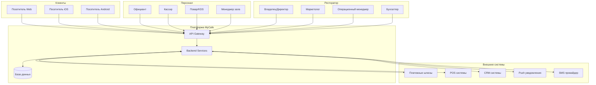
```mermaid
graph TB
    subgraph Клиенты
        C1[Посетитель Web]
        C2[Посетитель iOS]
        C3[Посетитель Android]
    end
    
    subgraph Персонал
        S1[Официант]
        S2[Кассир]
        S3[Повар/KDS]
        S4[Менеджер зала]
    end
    
    subgraph Ресторатор
        R1[Владелец/Директор]
        R2[Маркетолог]
        R3[Операционный менеджер]
        R4[Бухгалтер]
    end
    
    subgraph Платформа MyCafe
        API[API Gateway]
        BACKEND[Backend Services]
        DB[(База данных)]
    end
    
    subgraph Внешние системы
        PAY[Платежные шлюзы]
        POS[POS системы]
        CRM[CRM системы]
        PUSH[Push уведомления]
        SMS[SMS провайдер]
    end
    
    C1 & C2 & C3 --> API
    S1 & S2 & S3 & S4 --> API
    R1 & R2 & R3 & R4 --> API
    API --> BACKEND
    BACKEND --> DB
    BACKEND <--> PAY
    BACKEND <--> POS
    BACKEND <--> CRM
    BACKEND --> PUSH
    BACKEND --> SMS
```

### 3.2 Текущее положение

- У большинства ресторанов отсутствует собственное качественное приложение/веб-канал.
- Фрагментация решений (меню, заказы, лояльность, оплата, аналитика) без единого контура.
- Высокие пороги стоимости и компетенций для запуска мобильных приложений.
- Отсутствие гибких инструментов брендирования и настройки под потребности конкретного ресторана.
- Сложность интеграции различных систем (POS, платежи, доставка, лояльность).
- Недостаток аналитических инструментов для принятия управленческих решений.

## 4. Требования к Платформе

### 4.1 Общие требования

- Архитектура: трехуровневая клиент — сервер приложений — сервер БД; микросервисная/модульная; мультиарендность (multi-tenant).
- Единая централизованная БД/кластер БД с изоляцией данных арендаторов.
- Единый механизм аутентификации/авторизации (поддержка SSO OAuth 2.0/OIDC, JWT).
- Кроссплатформенность: Web (современные браузеры), iOS/Android (актуальные версии).
- Мультиязычность интерфейсов (минимум: русский, английский; по требованию: локализация).
- Масштабируемость по нагрузке (горизонтально), наблюдаемость (логирование, трассировка, метрики).
- Высокая доступность (целевой SLA 99.5%+ для производственной среды, без учета плановых работ).
- Соблюдение ИБ, защиту персональных данных, защиту платежных данных (при необходимости — PCI DSS SAQ A/A-EP).

#### 4.1.0 Архитектура системы


```mermaid
graph TB
    subgraph Клиентский уровень
        WEB[Web App PWA]
        IOS[iOS App]
        AND[Android App]
        STAFF[Staff App]
        ADMIN[Admin Panel]
    end
    
    subgraph API Gateway Layer
        APIGW[API Gateway]
        AUTH[Auth Service]
        RATELIMIT[Rate Limiter]
    end
    
    subgraph Микросервисы
        TENANT[Tenant Service]
        MENU[Menu Service]
        ORDER[Order Service]
        PAY[Payment Service]
        LOYALTY[Loyalty Service]
        BOOKING[Booking Service]
        NOTIF[Notification Service]
        ANALYTICS[Analytics Service]
        BUILDER[App Builder Service]
    end
    
    subgraph Инфраструктурные сервисы
        QUEUE[Message Queue]
        CACHE[Redis Cache]
        SEARCH[Search Engine]
        STORAGE[File Storage]
    end
    
    subgraph Слой данных
        MAINDB[(Primary DB)]
        REPLICA[(Read Replicas)]
        WAREHOUSE[(Data Warehouse)]
    end
    
    subgraph Внешние интеграции
        PAYMENT[Payment Gateways]
        POS_SYS[POS Systems]
        PUSH_SRV[Push Services]
        SMS_SRV[SMS Services]
        MAPS[Maps API]
    end
    
    subgraph Мониторинг
        LOGS[Logging]
        METRICS[Metrics]
        TRACE[Tracing]
        ALERT[Alerting]
    end
    
    WEB & IOS & AND & STAFF & ADMIN --> APIGW
    APIGW --> AUTH
    APIGW --> RATELIMIT
    APIGW --> TENANT
    APIGW --> MENU
    APIGW --> ORDER
    APIGW --> PAY
    APIGW --> LOYALTY
    APIGW --> BOOKING
    APIGW --> NOTIF
    APIGW --> ANALYTICS
    APIGW --> BUILDER
    
    TENANT & MENU & ORDER & PAY & LOYALTY & BOOKING --> MAINDB
    TENANT & MENU & ORDER & PAY & LOYALTY & BOOKING --> CACHE
    TENANT & MENU & ORDER & PAY & LOYALTY & BOOKING --> QUEUE
    
    MENU --> SEARCH
    ORDER --> STORAGE
    BUILDER --> STORAGE
    
    MAINDB --> REPLICA
    MAINDB --> WAREHOUSE
    
    PAY --> PAYMENT
    ORDER --> POS_SYS
    NOTIF --> PUSH_SRV
    NOTIF --> SMS_SRV
    BOOKING --> MAPS
    
    TENANT & MENU & ORDER & PAY & LOYALTY & BOOKING --> LOGS
    TENANT & MENU & ORDER & PAY & LOYALTY & BOOKING --> METRICS
    TENANT & MENU & ORDER & PAY & LOYALTY & BOOKING --> TRACE
    METRICS --> ALERT
```

Принципы:

- **Масштабируемость**: рост количества ресторанов, пользователей, заказов; поддержка x3 роста данных при наращивании мощностей.
- **Гибкость**: подключение новых модулей/интеграций без остановки сервиса.
- **Наблюдаемость**: audit trail, журналирование операций, мониторинг (APM, метрики).
- **Достоверность**: транзакционная целостность, идемпотентность платежей и вебхуков.
- **Стандартизация и совместимость**: REST/GraphQL API, webhooks, очереди/шина событий.

#### 4.1.1 Структура и функционирование

Подсистемы/модули:

**Обеспечивающие:**

- Модуль администрирования Платформы (суперадмин).
- Модуль ИБ (политики доступа, аудит, шифрование, KMS).
- Подсистема справочников и классификаторов (единицы измерения, валюты, языки, причины отмен, статусы).
- Шина обмена данными/очереди (event bus, webhooks, ретраи).
- Модуль биллинга арендаторов (тарифы, лимиты, платежи за подписку).
- Модуль управления сборками white-label приложений (генерация, подпись, публикация, конфигурации).
- Подсистема уведомлений (Push, Email, SMS, In-app).
- Подсистема аналитики и отчетности (OLAP/дашборды).
- Подсистема резервного копирования и восстановления.

**Функциональные (для Ресторатора и Клиентов):**

- Визуальный редактор меню и каталога (категории, блюда, модификаторы, комбо, фото/видео, allergens).
- Редактор брендинга и шаблонов интерфейсов (цвета, шрифты, логотип, стартовые экраны, баннеры).
- Управление филиалами, залами и картой столов (залы, столы, QR-коды, схемы).
- Заказы: доставка, самовывоз, к столу (QR-order), предзаказ, расписания, тайм-слоты.
- Бронирование столиков (ресурсное расписание, депозиты, no-show политика).
- Корзина, оплата, транзакции, фискализация/чеки (через интеграции).
- Программа лояльности (баллы, статусы, кэшбэк, промокоды, подарочные сертификаты).
- Управление промо-акциями и баннерами.
- Приложение Клиента (каталог/меню, поиск, фильтры, заказ, оплата, трекинг статуса, лояльность, отзывы).
- Приложение Сотрудника (официант/кассир/повар/менеджер зала): KDS, статусы заказов, закрытие чеков, пересадка столов, сплит счетов.
- Интеграции: платежные шлюзы, Push (Firebase/APNS), POS, CRM, службы доставки, карты/геокодинг.
- Панель мониторинга в реальном времени (очередь заказов, SLA кухни, средний чек, выручка).

##### 4.1.1.1 Назначение основных подсистем

- **Администрирование Платформы**: управление арендаторами, тарифами, лимитами, аудитом, доступом, конфигурацией интеграций по умолчанию.
- **ИБ**: политики паролей/2FA, RBAC/ABAC, шифрование PII в покое и в транзите (TLS 1.2+), контроль соответствия.
- **Справочники/классификаторы**: унификация данных и валидаторов.
- **Шина данных**: событийно-ориентированное взаимодействие между сервисами и внешними системами, гарантированная доставка, идемпотентность.
- **Отчеты и аналитика**: финансовые, операционные, маркетинговые, когортный анализ, удержание, LTV, NPS/оценки.
- **Генерация приложений**: конвейер сборки white-label iOS/Android/Web, управление сертификатами, профилями, bundleId/keystore.

##### Процесс генерации White-Label приложений

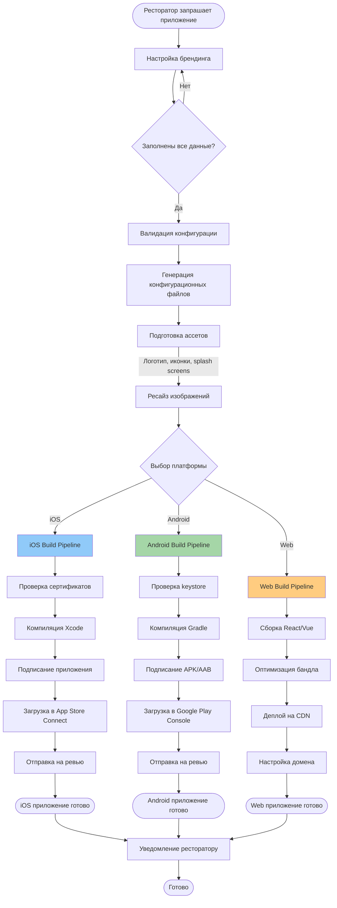
```mermaid
flowchart TD
    START([Ресторатор запрашает приложение]) --> CONFIG[Настройка брендинга]
    CONFIG --> INPUT{Заполнены все данные?}
    INPUT -->|Нет| CONFIG
    INPUT -->|Да| VALIDATE[Валидация конфигурации]
    
    VALIDATE --> GENERATE[Генерация конфигурационных файлов]
    GENERATE --> ASSETS[Подготовка ассетов]
    ASSETS --> |Логотип, иконки, splash screens| RESIZE[Ресайз изображений]
    
    RESIZE --> BRANCH{Выбор платформы}
    
    BRANCH -->|iOS| IOS_BUILD[iOS Build Pipeline]
    BRANCH -->|Android| AND_BUILD[Android Build Pipeline]
    BRANCH -->|Web| WEB_BUILD[Web Build Pipeline]
    
    IOS_BUILD --> IOS_CERT[Проверка сертификатов]
    IOS_CERT --> IOS_COMPILE[Компиляция Xcode]
    IOS_COMPILE --> IOS_SIGN[Подписание приложения]
    IOS_SIGN --> IOS_UPLOAD[Загрузка в App Store Connect]
    IOS_UPLOAD --> IOS_SUBMIT[Отправка на ревью]
    IOS_SUBMIT --> IOS_DONE([iOS приложение готово])
    
    AND_BUILD --> AND_KEY[Проверка keystore]
    AND_KEY --> AND_COMPILE[Компиляция Gradle]
    AND_COMPILE --> AND_SIGN[Подписание APK/AAB]
    AND_SIGN --> AND_UPLOAD[Загрузка в Google Play Console]
    AND_UPLOAD --> AND_SUBMIT[Отправка на ревью]
    AND_SUBMIT --> AND_DONE([Android приложение готово])
    
    WEB_BUILD --> WEB_COMPILE[Сборка React/Vue]
    WEB_COMPILE --> WEB_OPTIMIZE[Оптимизация бандла]
    WEB_OPTIMIZE --> WEB_DEPLOY[Деплой на CDN]
    WEB_DEPLOY --> WEB_DNS[Настройка домена]
    WEB_DNS --> WEB_DONE([Web приложение готово])
    
    IOS_DONE --> NOTIFY[Уведомление ресторатору]
    AND_DONE --> NOTIFY
    WEB_DONE --> NOTIFY
    NOTIFY --> END([Готово])
    
    style IOS_BUILD fill:#90CAF9
    style AND_BUILD fill:#A5D6A7
    style WEB_BUILD fill:#FFCC80
```

##### Компоненты white-label конфигурации

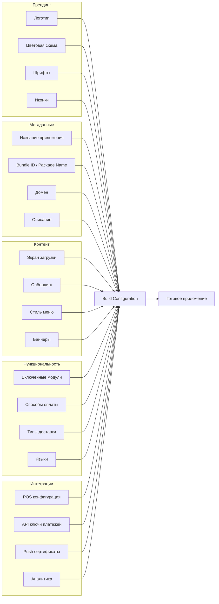
```mermaid
graph LR
    subgraph Брендинг
        LOGO[Логотип]
        COLORS[Цветовая схема]
        FONTS[Шрифты]
        ICONS[Иконки]
    end
    
    subgraph Метаданные
        NAME[Название приложения]
        BUNDLE[Bundle ID / Package Name]
        DOMAIN[Домен]
        DESC[Описание]
    end
    
    subgraph Контент
        SPLASH[Экран загрузки]
        ONBOARD[Онбординг]
        MENU_STYLE[Стиль меню]
        BANNERS[Баннеры]
    end
    
    subgraph Функциональность
        FEATURES[Включенные модули]
        PAYMENT_METHODS[Способы оплаты]
        DELIVERY[Типы доставки]
        LANGS[Языки]
    end
    
    subgraph Интеграции
        POS_CONF[POS конфигурация]
        PAYMENT_KEYS[API ключи платежей]
        PUSH_CERT[Push сертификаты]
        ANALYTICS[Аналитика]
    end
    
    LOGO & COLORS & FONTS & ICONS --> BUILD_CONFIG[Build Configuration]
    NAME & BUNDLE & DOMAIN & DESC --> BUILD_CONFIG
    SPLASH & ONBOARD & MENU_STYLE & BANNERS --> BUILD_CONFIG
    FEATURES & PAYMENT_METHODS & DELIVERY & LANGS --> BUILD_CONFIG
    POS_CONF & PAYMENT_KEYS & PUSH_CERT & ANALYTICS --> BUILD_CONFIG
    
    BUILD_CONFIG --> APP[Готовое приложение]
```

##### 4.1.1.2 Режимы функционирования

- **Штатный режим** — 24/7.
- **Ограниченный режим** — при частичной недоступности внешних интеграций, работа в деградированном режиме (например, прием заказов без онлайн-оплаты).
- **Сервисный режим** — плановые работы по регламенту (с уведомлением).
- **Аварийный режим** — согласно плану реагирования на инциденты (IRP), с восстановлением из резервных копий при необходимости.

##### 4.1.1.3 Перспективы развития

- Маркетплейс плагинов/виджетов внутри Платформы.
- Собственный курьерский модуль и роутинг.
- Персонализация рекомендаций (ML).
- Программа партнерских кросс-акций между ресторанами.

#### 4.1.2 Пользователи и роли

Категории:

- Посетитель (Клиент).
- Ресторатор (владелец/администратор ресторана).
- Персонал ресторана: Официант, Кассир, Повар (KDS), Менеджер зала.
- Администратор Платформы (Super Admin).

Роли ресторатора (пример):

- **Владелец/Директор** (полный доступ в рамках арендатора).
- **Маркетолог** (брендинг, промо, лояльность, контент).
- **Операционный менеджер** (заказы, бронь, залы, смены).
- **Бухгалтер** (финансы, отчеты).
- **Тех. администратор** (интеграции, API ключи).

Численность пользователей не ограничивается; Платформа должна поддерживать рост до десятков тысяч клиентов в онлайне и тысяч заказов в час суммарно (масштабируется инфраструктурой).

##### Основные пользовательские сценарии (Use Cases)

###### UC-01: Заказ с доставкой

**Актор:** Клиент

**Предусловия:** Клиент зарегистрирован в системе, выбран ресторан

**Основной сценарий:**

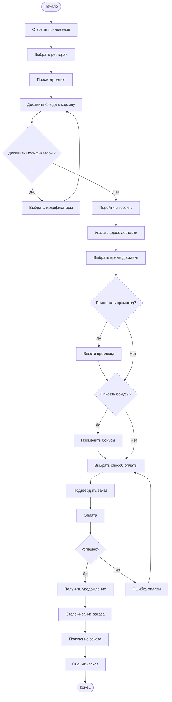
```mermaid
graph TD
    START([Начало]) --> OPEN[Открыть приложение]
    OPEN --> SELECT[Выбрать ресторан]
    SELECT --> BROWSE[Просмотр меню]
    BROWSE --> ADD[Добавить блюда в корзину]
    ADD --> MODIFY{Добавить модификаторы?}
    MODIFY -->|Да| ADD_MOD[Выбрать модификаторы]
    ADD_MOD --> ADD
    MODIFY -->|Нет| CART[Перейти в корзину]
    
    CART --> ADDR[Указать адрес доставки]
    ADDR --> TIME[Выбрать время доставки]
    TIME --> PROMO{Применить промокод?}
    PROMO -->|Да| APPLY_PROMO[Ввести промокод]
    APPLY_PROMO --> BONUS
    PROMO -->|Нет| BONUS{Списать бонусы?}
    
    BONUS -->|Да| APPLY_BONUS[Применить бонусы]
    APPLY_BONUS --> PAY
    BONUS -->|Нет| PAY[Выбрать способ оплаты]
    
    PAY --> CONFIRM[Подтвердить заказ]
    CONFIRM --> PAYMENT[Оплата]
    PAYMENT --> SUCCESS{Успешно?}
    
    SUCCESS -->|Да| NOTIFY[Получить уведомление]
    SUCCESS -->|Нет| ERROR[Ошибка оплаты]
    ERROR --> PAY
    
    NOTIFY --> TRACK[Отслеживание заказа]
    TRACK --> DELIVER[Получение заказа]
    DELIVER --> RATE[Оценить заказ]
    RATE --> END([Конец])
```

**Постусловия:** Заказ создан, оплачен, передан в ресторан

**Альтернативные сценарии:**
- A1: Блюдо недоступно → уведомление → выбор другого блюда
- A2: Минимальная сумма не достигнута → уведомление → добавление блюд
- A3: Зона доставки недоступна → предложение самовывоза

###### UC-02: QR-заказ к столу

**Актор:** Посетитель в ресторане

**Предусловия:** Посетитель находится в ресторане за столом с QR-кодом

**Основной сценарий:**

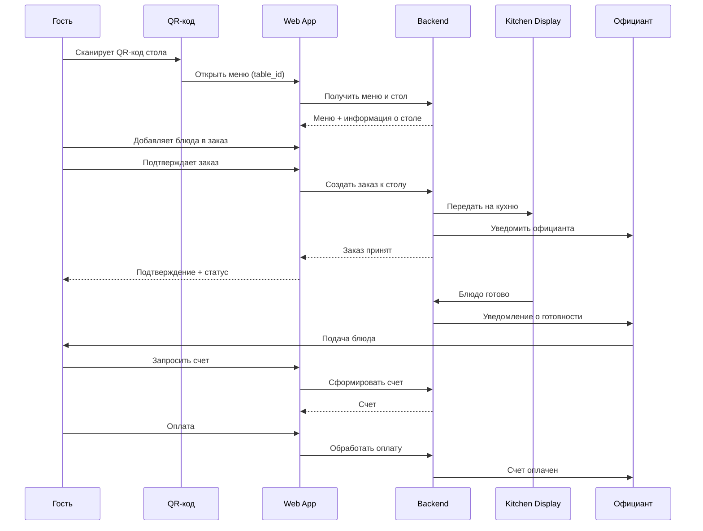
```mermaid
sequenceDiagram
    participant G as Гость
    participant QR as QR-код
    participant APP as Web App
    participant API as Backend
    participant KDS as Kitchen Display
    participant W as Официант
    
    G->>QR: Сканирует QR-код стола
    QR->>APP: Открыть меню (table_id)
    APP->>API: Получить меню и стол
    API-->>APP: Меню + информация о столе
    
    G->>APP: Добавляет блюда в заказ
    G->>APP: Подтверждает заказ
    APP->>API: Создать заказ к столу
    API->>KDS: Передать на кухню
    API->>W: Уведомить официанта
    API-->>APP: Заказ принят
    APP-->>G: Подтверждение + статус
    
    KDS->>API: Блюдо готово
    API->>W: Уведомление о готовности
    W->>G: Подача блюда
    
    G->>APP: Запросить счет
    APP->>API: Сформировать счет
    API-->>APP: Счет
    G->>APP: Оплата
    APP->>API: Обработать оплату
    API->>W: Счет оплачен
```

###### UC-03: Настройка white-label приложения

**Актор:** Владелец ресторана

**Предусловия:** Ресторан зарегистрирован в системе, выбран тарифный план

**Основной сценарий:**

1. Владелец входит в панель управления
2. Переходит в раздел "Мобильное приложение"
3. Загружает логотип и иконку приложения
4. Настраивает цветовую схему (основной, акцентный цвета)
5. Выбирает шрифты
6. Настраивает экран загрузки
7. Заполняет метаданные:
   - Название приложения
   - Описание для сторов
   - Ключевые слова
   - Контактная информация
8. Выбирает включенные модули (доставка, бронирование, лояльность)
9. Указывает домен для web-версии
10. Запускает генерацию приложений
11. Система собирает iOS, Android и Web версии
12. Получает ссылки для скачивания и публикации

**Постусловия:** Брендированное приложение готово к публикации

###### UC-04: Управление программой лояльности

**Актор:** Маркетолог ресторана

**Предусловия:** Настроена программа лояльности

**Основной сценарий:**

1. Маркетолог входит в панель управления
2. Переходит в раздел "Лояльность"
3. Настраивает правила начисления:
   - Процент кэшбэка от суммы заказа
   - Бонусы за регистрацию
   - Бонусы в день рождения
4. Создает уровни лояльности:
   - Порог активации
   - Преимущества уровня
   - Условия сохранения
5. Создает промокоды:
   - Тип скидки (процент/фиксированная сумма)
   - Период действия
   - Лимит использований
   - Условия применения
6. Настраивает push-уведомления о начислениях
7. Активирует программу
8. Отслеживает эффективность в аналитике

**Постусловия:** Программа лояльности активна, клиенты получают бонусы

#### 4.1.3 Требования к надежности

- Высокая доступность сервисов (кластеризация/автоскейлинг).
- Резервное копирование: ежедневные инкрементальные, еженедельные полные, хранение не менее 30 дней; тест восстановления не реже 1 раза в квартал.
- Устойчивость к сбоям: отказоустойчивые БД (репликация), очереди, кэш.
- Журналирование, алертинг, SLO/ошибки и латентность контролируются.
- Дозащита от ошибочных действий пользователей (подтверждения, soft delete, версии).

#### 4.1.4 Требования безопасности

- Аутентификация: email/телефон+пароль, соц. входы, 2FA (опционально).
- Авторизация: ролевая (RBAC), возможно атрибутивная (ABAC).
- Шифрование: TLS 1.2+, шифрование PII/секретов на хранении (KMS/HSM).
- Сегментация данных арендаторов; запрет утечек между арендаторами.
- Соответствие ISO/IEC 27001/27002; OWASP ASVS/MASVS; PCI DSS SAQ A при редиректе на платежного провайдера.
- Антифрод/скоринг по заказам (базовый), защита от бот-трафика (reCAPTCHA/ковенанты).
- Логи аудита (кто, что, когда изменил), неизменяемые журналы (WORM) по критичным операциям.

##### Схема безопасности и защиты данных

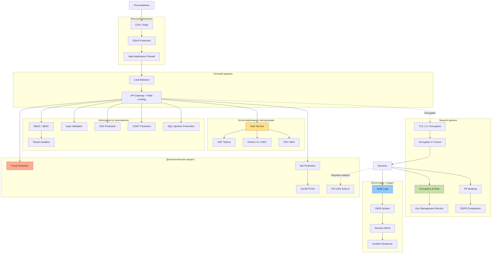
```mermaid
graph TB
    subgraph Внешний периметр
        WAF[Web Application Firewall]
        DDOS[DDoS Protection]
        CDN[CDN / Edge]
    end
    
    subgraph Сетевой уровень
        LB[Load Balancer]
        APIGW[API Gateway + Rate Limiting]
    end
    
    subgraph Аутентификация и авторизация
        AUTH[Auth Service]
        JWT[JWT Tokens]
        OAUTH[OAuth 2.0 / OIDC]
        MFA[2FA / MFA]
    end
    
    subgraph Безопасность приложения
        RBAC[RBAC / ABAC]
        TENANT_ISO[Tenant Isolation]
        INPUT_VAL[Input Validation]
        XSS[XSS Protection]
        CSRF[CSRF Protection]
        SQL_INJ[SQL Injection Prevention]
    end
    
    subgraph Защита данных
        TLS[TLS 1.2+ Encryption]
        KMS[Key Management Service]
        ENCRYPT_REST[Encryption at Rest]
        ENCRYPT_TRANSIT[Encryption in Transit]
        PII_MASK[PII Masking]
        GDPR[GDPR Compliance]
    end
    
    subgraph Мониторинг и аудит
        AUDIT_LOG[Audit Logs]
        SIEM[SIEM System]
        ALERT_SEC[Security Alerts]
        INCIDENT[Incident Response]
    end
    
    subgraph Дополнительная защита
        FRAUD[Fraud Detection]
        BOT_PROTECT[Bot Protection]
        RECAPTCHA[reCAPTCHA]
        PCI_DSS[PCI DSS SAQ-A]
    end
    
    USER[Пользователь] --> CDN
    CDN --> DDOS
    DDOS --> WAF
    WAF --> LB
    LB --> APIGW
    
    APIGW --> AUTH
    AUTH --> JWT
    AUTH --> OAUTH
    AUTH --> MFA
    
    APIGW --> RBAC
    RBAC --> TENANT_ISO
    APIGW --> INPUT_VAL
    APIGW --> XSS
    APIGW --> CSRF
    APIGW --> SQL_INJ
    
    APIGW -.->|Encrypted| TLS
    TLS --> ENCRYPT_TRANSIT
    ENCRYPT_TRANSIT --> SERVICES[Services]
    SERVICES --> ENCRYPT_REST
    ENCRYPT_REST --> KMS
    
    SERVICES --> PII_MASK
    PII_MASK --> GDPR
    
    SERVICES --> AUDIT_LOG
    AUDIT_LOG --> SIEM
    SIEM --> ALERT_SEC
    ALERT_SEC --> INCIDENT
    
    APIGW --> FRAUD
    APIGW --> BOT_PROTECT
    BOT_PROTECT --> RECAPTCHA
    
    SERVICES -.->|Payment redirect| PCI_DSS
    
    style AUTH fill:#FFE082
    style ENCRYPT_REST fill:#C5E1A5
    style AUDIT_LOG fill:#90CAF9
    style FRAUD fill:#FFAB91
```

##### Модель управления доступом (RBAC)


```mermaid
graph TB
    subgraph Роли платформы
        SUPERADMIN[Super Admin]
    end
    
    subgraph Роли ресторана
        OWNER[Владелец]
        MANAGER[Менеджер]
        MARKETER[Маркетолог]
        ACCOUNTANT[Бухгалтер]
        TECH_ADMIN[Тех. администратор]
    end
    
    subgraph Роли персонала
        HALL_MANAGER[Менеджер зала]
        WAITER[Официант]
        CASHIER[Кассир]
        COOK[Повар]
    end
    
    subgraph Разрешения
        TENANT_MGMT[Управление арендаторами]
        BILLING[Биллинг и тарифы]
        SYSTEM_CONFIG[Системные настройки]
        
        MENU_EDIT[Редактирование меню]
        BRAND_EDIT[Настройка брендинга]
        PROMO_EDIT[Управление промо]
        REPORTS[Отчеты и аналитика]
        INTEGRATIONS[Настройка интеграций]
        
        ORDER_VIEW[Просмотр заказов]
        ORDER_MANAGE[Управление заказами]
        TABLE_MANAGE[Управление столами]
        BOOKING_MANAGE[Управление бронированиями]
        
        KDS_ACCESS[Доступ к KDS]
        POS_ACCESS[Доступ к кассе]
    end
    
    SUPERADMIN --> TENANT_MGMT
    SUPERADMIN --> BILLING
    SUPERADMIN --> SYSTEM_CONFIG
    
    OWNER --> MENU_EDIT
    OWNER --> BRAND_EDIT
    OWNER --> PROMO_EDIT
    OWNER --> REPORTS
    OWNER --> INTEGRATIONS
    OWNER --> ORDER_VIEW
    OWNER --> ORDER_MANAGE
    
    MANAGER --> ORDER_VIEW
    MANAGER --> ORDER_MANAGE
    MANAGER --> TABLE_MANAGE
    MANAGER --> BOOKING_MANAGE
    
    MARKETER --> PROMO_EDIT
    MARKETER --> REPORTS
    
    ACCOUNTANT --> REPORTS
    
    TECH_ADMIN --> INTEGRATIONS
    
    HALL_MANAGER --> ORDER_VIEW
    HALL_MANAGER --> TABLE_MANAGE
    HALL_MANAGER --> BOOKING_MANAGE
    
    WAITER --> ORDER_VIEW
    WAITER --> TABLE_MANAGE
    
    CASHIER --> POS_ACCESS
    CASHIER --> ORDER_VIEW
    
    COOK --> KDS_ACCESS
```

#### 4.1.5 Эргономика и техническая эстетика

- Единая дизайн-система (шрифты, цвета, компоненты).
- Минимизация действий в частых сценариях (оформление заказа ≤ 5 шагов).
- Доступность: контраст, размеры кликабельных зон, поддержка screen readers (по возможности).
- Подтверждения на удаление/важные операции, информативные сообщения об ошибках.

#### 4.1.6 Эксплуатация, обслуживание, хранение

- Регламенты обновлений, окна простой/degraded режима.
- Инструкции по резервному копированию/восстановлению, чек-листы.
- Обновления без простоя (blue/green, rolling), по возможности.

#### 4.1.7 Дополнительные требования

- Масштабируемые интерфейсы и БД.
- Возможность включения/выключения модулей на уровне арендатора.
- Встроенные подсказки/обучающие туры для пользователей.

### 4.2 Требования к функциям

#### Обеспечивающие модули

**Администрирование Платформы:**

- Управление арендаторами (создание, тариф, лимиты, статусы).
- Управление пользователями и ролями (RBAC), SSO настройка.
- Управление конфигурациями интеграций по умолчанию.
- Мониторинг сервисов, очередей, статусов сборок приложений.
- Аудит действий, журнал событий, экспорт логов.
- Управление биллингом арендаторов (подписки, инвойсы, платежи).

**Информационная безопасность:**

- Политики паролей, MFA, сессии, блокировки по брутфорсу.
- Управление ключами API, ротация секретов.
- Контроль доступа к данным (тенант-изоляция).
- Политики хранения и удаления персональных данных.

**Справочники/классификаторы:**

- Валюты, единицы измерения, НДС/налоги, типы модификаторов.
- География (страны, города, зоны доставки).
- Причины отмен, статусы заказов и бронирований.

**Шина обмена данными:**

- Публикация событий (OrderCreated, PaymentSucceeded, ReservationNoShow и пр.).
- Подписки внутренних микросервисов и внешних webhooks.
- Ретраи, дедупликация, идемпотентность.

**Уведомления:**

- Шаблоны и локализация (email/SMS/push/in-app).
- Триггеры и расписания, напоминания (бронь, статус, промо).

#### Функциональные модули (тенант — Ресторан/Сеть)

**Визуальный редактор меню:**

- Категории, блюда, описания, алергены, фото/видео.
- Модификаторы (обязательные/необязательные), наборы допов, варианты.
- Комбо/сет-меню, рекомендации, теги (веган, острое и пр.).
- Мультискладские цены/налоги/валюта, расписания доступности.

**Брендинг и шаблоны:**

- Логотип, цвета, шрифты, иконки.
- Настройка экранов: главный, каталог, баннеры, блоки.
- Домен/поддомен для WebApp, bundleId/packageName для мобильных.

**Управление филиалами и залами:**

- Филиалы, часы работы, адреса, зоны доставки (по радиусу/полигонам).
- Залы/столы (схема, QR-коды), статусы столов, объединение/пересадка.

**Заказы:**

- Каналы: доставка, самовывоз, к столу (QR-order), предзаказ.
- Процессинг: создание, подтверждение, оплата, KDS, выдача/доставка, закрытие.
- Таймслоты, ограничения по кухне/пиковым часам.
- Отмена/возврат по политике, частичный рефанд (если поддерживает провайдер).
- Чеки/фискализация через интеграции (там, где требуется законом).

##### Процесс оформления заказа (последовательность)

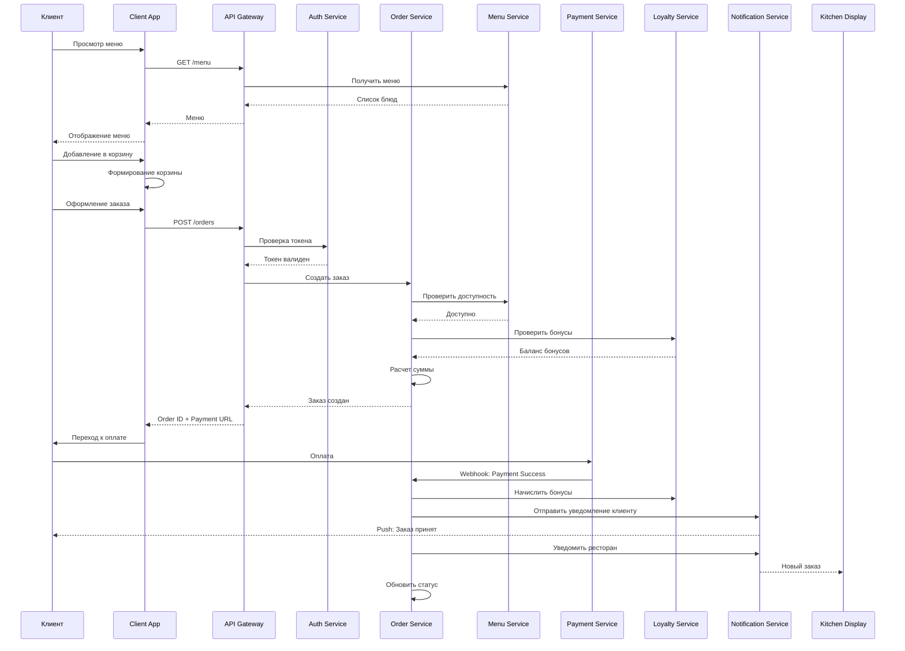
```mermaid
sequenceDiagram
    participant C as Клиент
    participant APP as Client App
    participant API as API Gateway
    participant AUTH as Auth Service
    participant ORDER as Order Service
    participant MENU as Menu Service
    participant PAY as Payment Service
    participant LOYALTY as Loyalty Service
    participant NOTIF as Notification Service
    participant KDS as Kitchen Display
    
    C->>APP: Просмотр меню
    APP->>API: GET /menu
    API->>MENU: Получить меню
    MENU-->>API: Список блюд
    API-->>APP: Меню
    APP-->>C: Отображение меню
    
    C->>APP: Добавление в корзину
    APP->>APP: Формирование корзины
    
    C->>APP: Оформление заказа
    APP->>API: POST /orders
    API->>AUTH: Проверка токена
    AUTH-->>API: Токен валиден
    
    API->>ORDER: Создать заказ
    ORDER->>MENU: Проверить доступность
    MENU-->>ORDER: Доступно
    
    ORDER->>LOYALTY: Проверить бонусы
    LOYALTY-->>ORDER: Баланс бонусов
    
    ORDER->>ORDER: Расчет суммы
    ORDER-->>API: Заказ создан
    API-->>APP: Order ID + Payment URL
    
    APP->>C: Переход к оплате
    C->>PAY: Оплата
    PAY->>ORDER: Webhook: Payment Success
    ORDER->>LOYALTY: Начислить бонусы
    
    ORDER->>NOTIF: Отправить уведомление клиенту
    NOTIF-->>C: Push: Заказ принят
    
    ORDER->>NOTIF: Уведомить ресторан
    NOTIF-->>KDS: Новый заказ
    
    ORDER->>ORDER: Обновить статус
```

##### Диаграмма состояний заказа

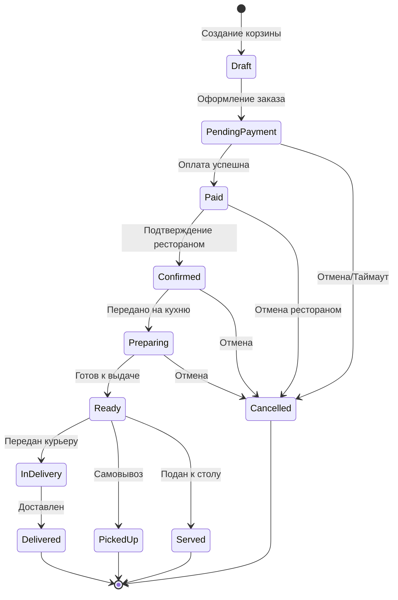
```mermaid
stateDiagram-v2
    [*] --> Draft: Создание корзины
    Draft --> PendingPayment: Оформление заказа
    
    PendingPayment --> Paid: Оплата успешна
    PendingPayment --> Cancelled: Отмена/Таймаут
    
    Paid --> Confirmed: Подтверждение рестораном
    Paid --> Cancelled: Отмена рестораном
    
    Confirmed --> Preparing: Передано на кухню
    Preparing --> Ready: Готов к выдаче
    
    Ready --> InDelivery: Передан курьеру
    Ready --> PickedUp: Самовывоз
    Ready --> Served: Подан к столу
    
    InDelivery --> Delivered: Доставлен
    
    Delivered --> [*]
    PickedUp --> [*]
    Served --> [*]
    
    Confirmed --> Cancelled: Отмена
    Preparing --> Cancelled: Отмена
    Cancelled --> [*]
```

**Бронирование:**

- Создание/подтверждение/отмена, депозиты, no-show.
- Привязка к столам, SLA, напоминания.

##### Процесс бронирования стола

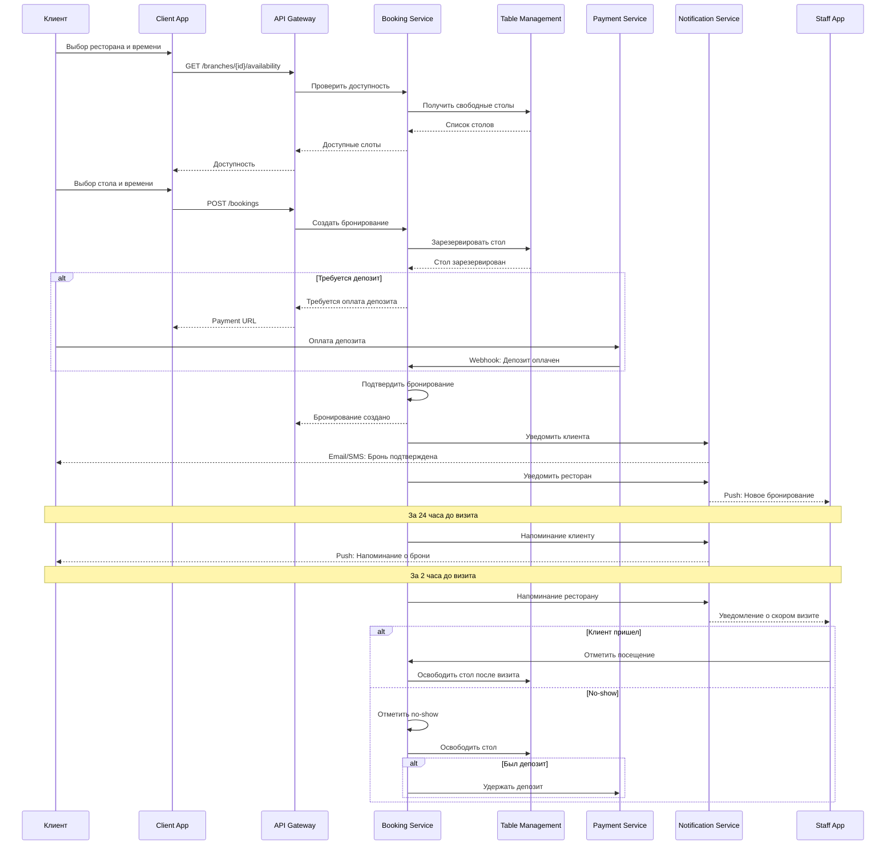
```mermaid
sequenceDiagram
    participant C as Клиент
    participant APP as Client App
    participant API as API Gateway
    participant BOOKING as Booking Service
    participant TABLE as Table Management
    participant PAY as Payment Service
    participant NOTIF as Notification Service
    participant STAFF as Staff App
    
    C->>APP: Выбор ресторана и времени
    APP->>API: GET /branches/{id}/availability
    API->>BOOKING: Проверить доступность
    BOOKING->>TABLE: Получить свободные столы
    TABLE-->>BOOKING: Список столов
    BOOKING-->>API: Доступные слоты
    API-->>APP: Доступность
    
    C->>APP: Выбор стола и времени
    APP->>API: POST /bookings
    API->>BOOKING: Создать бронирование
    
    BOOKING->>TABLE: Зарезервировать стол
    TABLE-->>BOOKING: Стол зарезервирован
    
    alt Требуется депозит
        BOOKING-->>API: Требуется оплата депозита
        API-->>APP: Payment URL
        C->>PAY: Оплата депозита
        PAY->>BOOKING: Webhook: Депозит оплачен
    end
    
    BOOKING->>BOOKING: Подтвердить бронирование
    BOOKING-->>API: Бронирование создано
    
    BOOKING->>NOTIF: Уведомить клиента
    NOTIF-->>C: Email/SMS: Бронь подтверждена
    
    BOOKING->>NOTIF: Уведомить ресторан
    NOTIF-->>STAFF: Push: Новое бронирование
    
    Note over C,STAFF: За 24 часа до визита
    BOOKING->>NOTIF: Напоминание клиенту
    NOTIF-->>C: Push: Напоминание о брони
    
    Note over C,STAFF: За 2 часа до визита
    BOOKING->>NOTIF: Напоминание ресторану
    NOTIF-->>STAFF: Уведомление о скором визите
    
    alt Клиент пришел
        STAFF->>BOOKING: Отметить посещение
        BOOKING->>TABLE: Освободить стол после визита
    else No-show
        BOOKING->>BOOKING: Отметить no-show
        BOOKING->>TABLE: Освободить стол
        alt Был депозит
            BOOKING->>PAY: Удержать депозит
        end
    end
```

##### Управление столами и залами

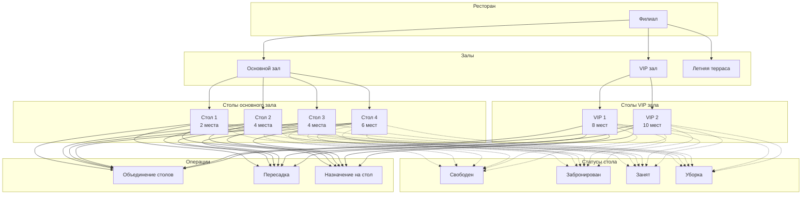
```mermaid
graph TB
    subgraph Ресторан
        BRANCH[Филиал]
    end
    
    subgraph Залы
        HALL1[Основной зал]
        HALL2[VIP зал]
        HALL3[Летняя терраса]
    end
    
    subgraph Столы основного зала
        T1[Стол 1<br/>2 места]
        T2[Стол 2<br/>4 места]
        T3[Стол 3<br/>4 места]
        T4[Стол 4<br/>6 мест]
    end
    
    subgraph Столы VIP зала
        T5[VIP 1<br/>8 мест]
        T6[VIP 2<br/>10 мест]
    end
    
    subgraph Статусы стола
        FREE[Свободен]
        RESERVED[Забронирован]
        OCCUPIED[Занят]
        CLEANING[Уборка]
    end
    
    subgraph Операции
        COMBINE[Объединение столов]
        MOVE[Пересадка]
        ASSIGN[Назначение на стол]
    end
    
    BRANCH --> HALL1 & HALL2 & HALL3
    HALL1 --> T1 & T2 & T3 & T4
    HALL2 --> T5 & T6
    
    T1 & T2 & T3 & T4 & T5 & T6 -.-> FREE
    T1 & T2 & T3 & T4 & T5 & T6 -.-> RESERVED
    T1 & T2 & T3 & T4 & T5 & T6 -.-> OCCUPIED
    T1 & T2 & T3 & T4 & T5 & T6 -.-> CLEANING
    
    T1 & T2 & T3 & T4 & T5 & T6 --> COMBINE
    T1 & T2 & T3 & T4 & T5 & T6 --> MOVE
    T1 & T2 & T3 & T4 & T5 & T6 --> ASSIGN
```

**Оплата:**

- Интеграция с платежными шлюзами (карты, Apple Pay/Google Pay, локальные).
- 3DS, сохранение токенов карт у провайдера (PCI DSS responsibility shift).
- Webhooks статусов платежей, обработка отказов/ретраев.

**Лояльность и промо:**

- Баллы, уровни, правила начисления/списания, кэшбэк.
- Промокоды (разовые/многоразовые, персональные/публичные), подарочные сертификаты.
- Лимиты, стекируемость, исключения по меню/категориям.

##### Процесс работы программы лояльности

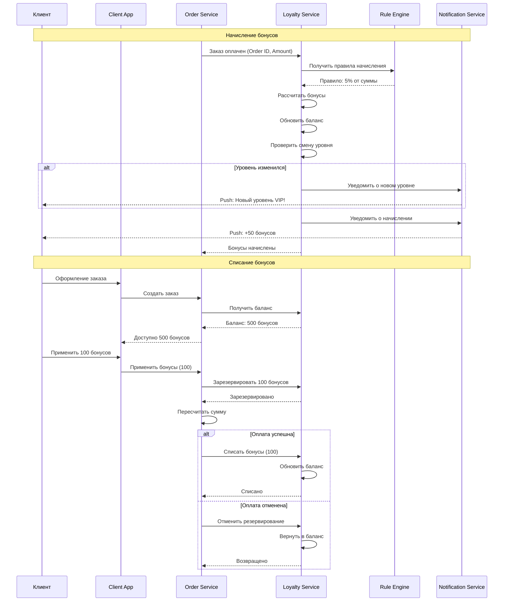
```mermaid
sequenceDiagram
    participant C as Клиент
    participant APP as Client App
    participant ORDER as Order Service
    participant LOYALTY as Loyalty Service
    participant RULE as Rule Engine
    participant NOTIF as Notification Service
    
    Note over C,NOTIF: Начисление бонусов
    
    ORDER->>LOYALTY: Заказ оплачен (Order ID, Amount)
    LOYALTY->>RULE: Получить правила начисления
    RULE-->>LOYALTY: Правило: 5% от суммы
    
    LOYALTY->>LOYALTY: Рассчитать бонусы
    LOYALTY->>LOYALTY: Обновить баланс
    LOYALTY->>LOYALTY: Проверить смену уровня
    
    alt Уровень изменился
        LOYALTY->>NOTIF: Уведомить о новом уровне
        NOTIF-->>C: Push: Новый уровень VIP!
    end
    
    LOYALTY->>NOTIF: Уведомить о начислении
    NOTIF-->>C: Push: +50 бонусов
    
    LOYALTY-->>ORDER: Бонусы начислены
    
    Note over C,NOTIF: Списание бонусов
    
    C->>APP: Оформление заказа
    APP->>ORDER: Создать заказ
    ORDER->>LOYALTY: Получить баланс
    LOYALTY-->>ORDER: Баланс: 500 бонусов
    
    ORDER-->>APP: Доступно 500 бонусов
    C->>APP: Применить 100 бонусов
    
    APP->>ORDER: Применить бонусы (100)
    ORDER->>LOYALTY: Зарезервировать 100 бонусов
    LOYALTY-->>ORDER: Зарезервировано
    
    ORDER->>ORDER: Пересчитать сумму
    
    alt Оплата успешна
        ORDER->>LOYALTY: Списать бонусы (100)
        LOYALTY->>LOYALTY: Обновить баланс
        LOYALTY-->>ORDER: Списано
    else Оплата отменена
        ORDER->>LOYALTY: Отменить резервирование
        LOYALTY->>LOYALTY: Вернуть в баланс
        LOYALTY-->>ORDER: Возвращено
    end
```

##### Уровни лояльности

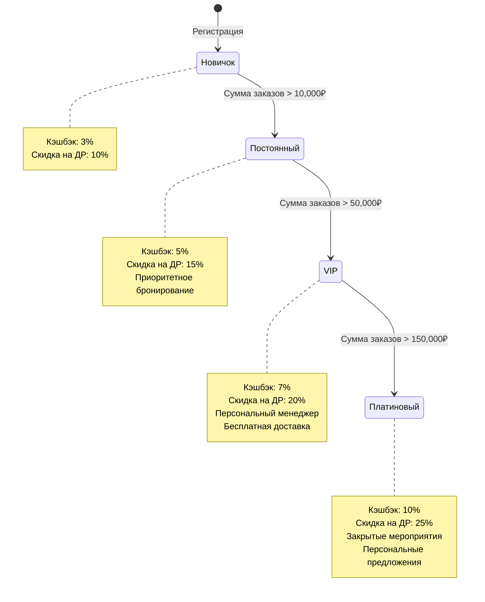
```mermaid
stateDiagram-v2
    [*] --> Новичок: Регистрация
    
    Новичок --> Постоянный: Сумма заказов > 10,000₽
    Постоянный --> VIP: Сумма заказов > 50,000₽
    VIP --> Платиновый: Сумма заказов > 150,000₽
    
    note right of Новичок
        Кэшбэк: 3%
        Скидка на ДР: 10%
    end note
    
    note right of Постоянный
        Кэшбэк: 5%
        Скидка на ДР: 15%
        Приоритетное бронирование
    end note
    
    note right of VIP
        Кэшбэк: 7%
        Скидка на ДР: 20%
        Персональный менеджер
        Бесплатная доставка
    end note
    
    note right of Платиновый
        Кэшбэк: 10%
        Скидка на ДР: 25%
        Закрытые мероприятия
        Персональные предложения
    end note
```

**Приложение клиента (iOS/Android/Web):**

- Регистрация/вход, профиль, адреса, способы оплаты (токены у провайдера).
- Каталог/поиск/фильтры, карточка блюда, корзина.
- Оформление заказа, выбор способа получения и времени.
- Трекинг статуса, чат/коммуникации (опционально), отзывы/оценки.
- Экран лояльности, история заказов, статус уровня.

**Приложение сотрудника (iOS/Android):**

- Авторизация персонала, роли.
- KDS: лента заказов, статусы (принят/готовится/готов/выдан).
- Официант/кассир: открытие/закрытие счета, сплит, печать, инкассация (через POS интеграцию).
- Карта столов: посадка/пересадка/объединение.
- Уведомления о новых заказах, SLA кухни.

**Аналитика/отчеты:**

- Продажи (по филиалам/категориям/блюдам/часам), средний чек, конверсия.
- Заказы (SLA, отмены, причины, источники).
- Лояльность (начисления/списания, возвраты, удержание).
- Эффективность промо, RFM, когортный анализ.
- Экспорт (CSV/XLSX), API для BI.

##### Архитектура аналитики и отчетности

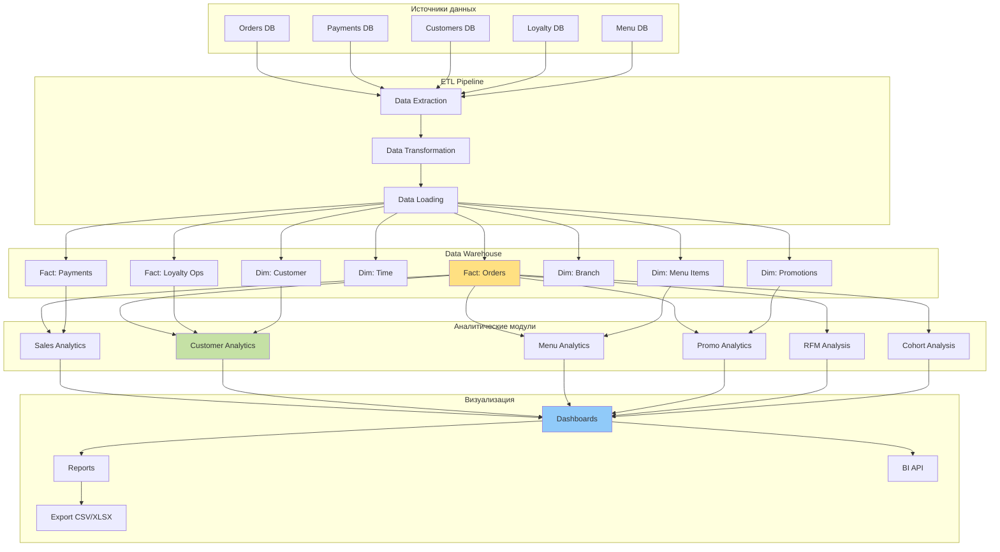
```mermaid
graph TB
    subgraph Источники данных
        ORDERS[Orders DB]
        PAYMENTS[Payments DB]
        CUSTOMERS[Customers DB]
        LOYALTY[Loyalty DB]
        MENU[Menu DB]
    end
    
    subgraph ETL Pipeline
        EXTRACT[Data Extraction]
        TRANSFORM[Data Transformation]
        LOAD[Data Loading]
    end
    
    subgraph Data Warehouse
        FACT_ORDERS[Fact: Orders]
        FACT_PAYMENTS[Fact: Payments]
        FACT_LOYALTY[Fact: Loyalty Ops]
        
        DIM_TIME[Dim: Time]
        DIM_CUSTOMER[Dim: Customer]
        DIM_BRANCH[Dim: Branch]
        DIM_MENU[Dim: Menu Items]
        DIM_PROMO[Dim: Promotions]
    end
    
    subgraph Аналитические модули
        SALES[Sales Analytics]
        CUSTOMER_ANALYTICS[Customer Analytics]
        MENU_ANALYTICS[Menu Analytics]
        PROMO_ANALYTICS[Promo Analytics]
        RFM[RFM Analysis]
        COHORT[Cohort Analysis]
    end
    
    subgraph Визуализация
        DASHBOARD[Dashboards]
        REPORTS[Reports]
        EXPORT[Export CSV/XLSX]
        API_BI[BI API]
    end
    
    ORDERS & PAYMENTS & CUSTOMERS & LOYALTY & MENU --> EXTRACT
    EXTRACT --> TRANSFORM
    TRANSFORM --> LOAD
    
    LOAD --> FACT_ORDERS
    LOAD --> FACT_PAYMENTS
    LOAD --> FACT_LOYALTY
    LOAD --> DIM_TIME
    LOAD --> DIM_CUSTOMER
    LOAD --> DIM_BRANCH
    LOAD --> DIM_MENU
    LOAD --> DIM_PROMO
    
    FACT_ORDERS --> SALES
    FACT_PAYMENTS --> SALES
    FACT_ORDERS --> CUSTOMER_ANALYTICS
    FACT_LOYALTY --> CUSTOMER_ANALYTICS
    DIM_CUSTOMER --> CUSTOMER_ANALYTICS
    
    FACT_ORDERS --> MENU_ANALYTICS
    DIM_MENU --> MENU_ANALYTICS
    
    FACT_ORDERS --> PROMO_ANALYTICS
    DIM_PROMO --> PROMO_ANALYTICS
    
    FACT_ORDERS --> RFM
    FACT_ORDERS --> COHORT
    
    SALES --> DASHBOARD
    CUSTOMER_ANALYTICS --> DASHBOARD
    MENU_ANALYTICS --> DASHBOARD
    PROMO_ANALYTICS --> DASHBOARD
    RFM --> DASHBOARD
    COHORT --> DASHBOARD
    
    DASHBOARD --> REPORTS
    REPORTS --> EXPORT
    DASHBOARD --> API_BI
    
    style FACT_ORDERS fill:#FFE082
    style CUSTOMER_ANALYTICS fill:#C5E1A5
    style DASHBOARD fill:#90CAF9
```

##### Ключевые метрики и KPI

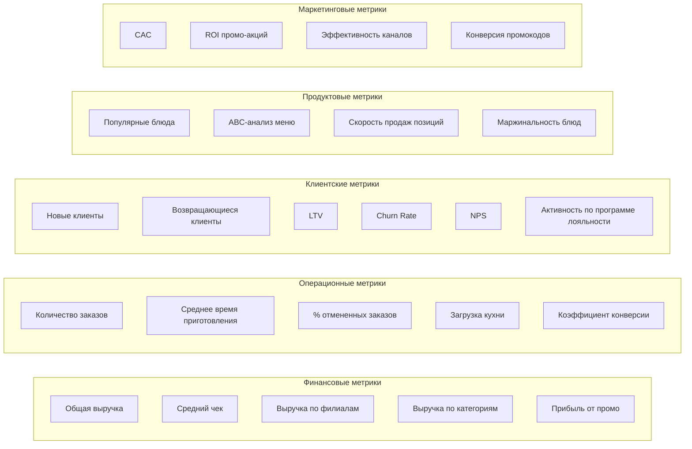
```mermaid
graph LR
    subgraph Финансовые метрики
        F1[Общая выручка]
        F2[Средний чек]
        F3[Выручка по филиалам]
        F4[Выручка по категориям]
        F5[Прибыль от промо]
    end
    
    subgraph Операционные метрики
        O1[Количество заказов]
        O2[Среднее время приготовления]
        O3[% отмененных заказов]
        O4[Загрузка кухни]
        O5[Коэффициент конверсии]
    end
    
    subgraph Клиентские метрики
        C1[Новые клиенты]
        C2[Возвращающиеся клиенты]
        C3[LTV]
        C4[Churn Rate]
        C5[NPS]
        C6[Активность по программе лояльности]
    end
    
    subgraph Продуктовые метрики
        P1[Популярные блюда]
        P2[ABC-анализ меню]
        P3[Скорость продаж позиций]
        P4[Маржинальность блюд]
    end
    
    subgraph Маркетинговые метрики
        M1[CAC]
        M2[ROI промо-акций]
        M3[Эффективность каналов]
        M4[Конверсия промокодов]
    end
```

**Интеграции:**

- Платежные шлюзы.
- Push (Firebase/APNS), SMS, email.
- POS/CRM/ERP (двунаправленно), доставочные платформы (через коннекторы).
- Карты/геокодинг/расчет расстояний.
- Фискальные регистраторы/онлайн-кассы (в странах, где требуется).

##### Схема интеграций с внешними системами


```mermaid
graph TB
    subgraph MyCafe Platform
        API[API Gateway]
        INTEGRATION[Integration Hub]
        WEBHOOK[Webhook Manager]
        QUEUE[Event Queue]
    end
    
    subgraph Платежные системы
        STRIPE[Stripe]
        PAYPAL[PayPal]
        YOOKASSA[ЮKassa]
        SBERBANK[Сбербанк]
        TINKOFF[Тинькофф]
    end
    
    subgraph Уведомления
        FCM[Firebase Cloud Messaging]
        APNS[Apple Push Notification]
        TWILIO[Twilio SMS]
        SENDGRID[SendGrid Email]
        MAILGUN[Mailgun]
    end
    
    subgraph POS системы
        RKEEPER[R-Keeper]
        IIKO[iiko]
        POSTER[Poster]
        CUSTOM_POS[Custom POS API]
    end
    
    subgraph CRM системы
        BITRIX24[Bitrix24]
        AMOCRM[amoCRM]
        SALESFORCE[Salesforce]
    end
    
    subgraph Доставка
        YANDEX_EDA[Яндекс.Еда]
        DELIVERY_CLUB[Delivery Club]
        OWN_DELIVERY[Собственная доставка]
    end
    
    subgraph Геосервисы
        GOOGLE_MAPS[Google Maps API]
        YANDEX_MAPS[Яндекс.Карты]
        DADATA[DaData]
    end
    
    subgraph Фискализация
        ATOL[АТОЛ Онлайн]
        ORANGEDATA[OrangeData]
        FISCAL_REG[Фискальные регистраторы]
    end
    
    subgraph Аналитика
        GA[Google Analytics]
        YAMETRIKA[Яндекс.Метрика]
        AMPLITUDE[Amplitude]
        MIXPANEL[Mixpanel]
    end
    
    API --> INTEGRATION
    INTEGRATION --> WEBHOOK
    INTEGRATION --> QUEUE
    
    INTEGRATION <-->|Payment API| STRIPE & PAYPAL & YOOKASSA & SBERBANK & TINKOFF
    
    INTEGRATION -->|Push API| FCM & APNS
    INTEGRATION -->|SMS API| TWILIO
    INTEGRATION -->|Email API| SENDGRID & MAILGUN
    
    INTEGRATION <-->|Sync Orders| RKEEPER & IIKO & POSTER & CUSTOM_POS
    
    INTEGRATION <-->|Customer Data| BITRIX24 & AMOCRM & SALESFORCE
    
    INTEGRATION <-->|Order Sync| YANDEX_EDA & DELIVERY_CLUB
    INTEGRATION -->|Delivery API| OWN_DELIVERY
    
    INTEGRATION -->|Geocoding| GOOGLE_MAPS & YANDEX_MAPS & DADATA
    
    INTEGRATION -->|Fiscal API| ATOL & ORANGEDATA & FISCAL_REG
    
    INTEGRATION -->|Events| GA & YAMETRIKA & AMPLITUDE & MIXPANEL
    
    style INTEGRATION fill:#FFE082
```

##### Процесс интеграции с POS системой

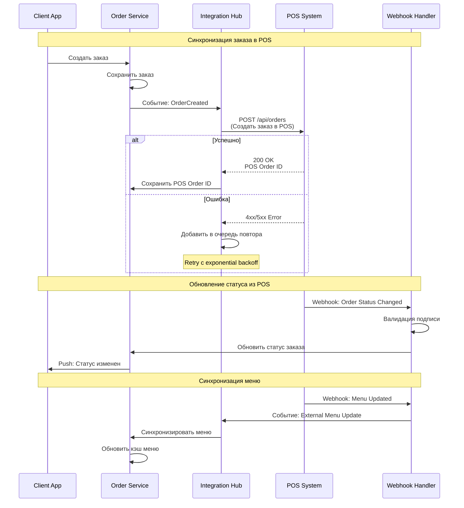
```mermaid
sequenceDiagram
    participant CLIENT as Client App
    participant ORDER as Order Service
    participant INTEGRATION as Integration Hub
    participant POS as POS System
    participant WEBHOOK as Webhook Handler
    
    Note over CLIENT,WEBHOOK: Синхронизация заказа в POS
    
    CLIENT->>ORDER: Создать заказ
    ORDER->>ORDER: Сохранить заказ
    ORDER->>INTEGRATION: Событие: OrderCreated
    
    INTEGRATION->>POS: POST /api/orders<br/>(Создать заказ в POS)
    
    alt Успешно
        POS-->>INTEGRATION: 200 OK<br/>POS Order ID
        INTEGRATION->>ORDER: Сохранить POS Order ID
    else Ошибка
        POS-->>INTEGRATION: 4xx/5xx Error
        INTEGRATION->>INTEGRATION: Добавить в очередь повтора
        Note over INTEGRATION: Retry с exponential backoff
    end
    
    Note over CLIENT,WEBHOOK: Обновление статуса из POS
    
    POS->>WEBHOOK: Webhook: Order Status Changed
    WEBHOOK->>WEBHOOK: Валидация подписи
    WEBHOOK->>ORDER: Обновить статус заказа
    ORDER->>CLIENT: Push: Статус изменен
    
    Note over CLIENT,WEBHOOK: Синхронизация меню
    
    POS->>WEBHOOK: Webhook: Menu Updated
    WEBHOOK->>INTEGRATION: Событие: External Menu Update
    INTEGRATION->>ORDER: Синхронизировать меню
    ORDER->>ORDER: Обновить кэш меню
```

##### Типы webhooks и событий

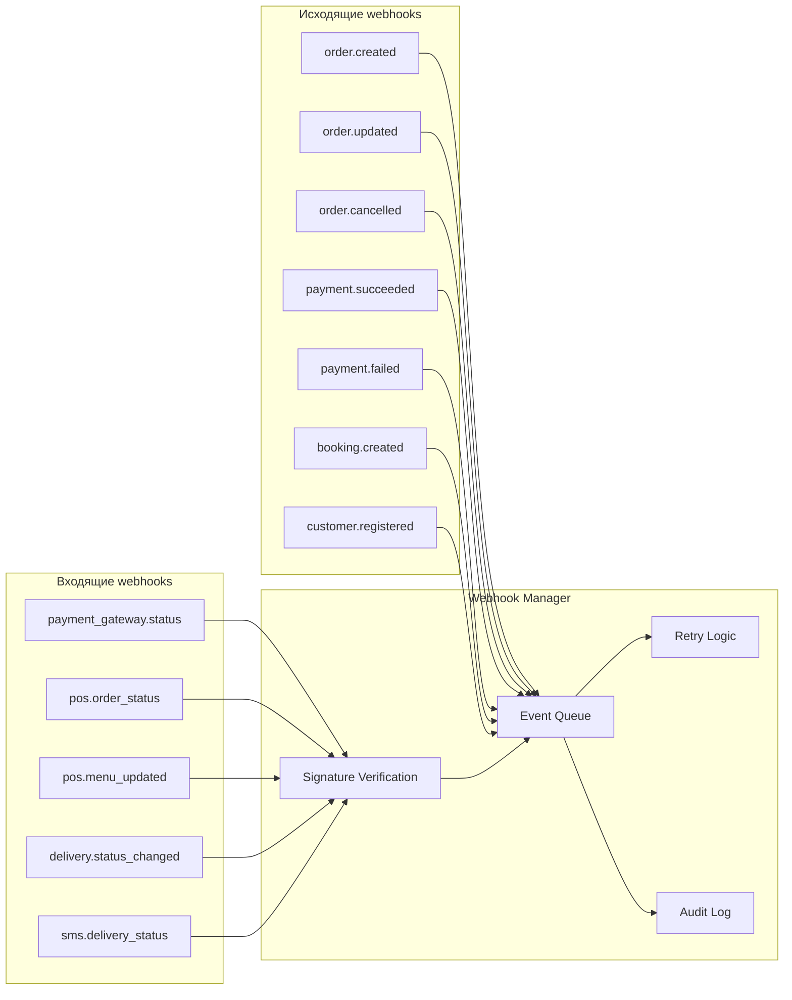
```mermaid
graph LR
    subgraph Исходящие webhooks
        OUT1[order.created]
        OUT2[order.updated]
        OUT3[order.cancelled]
        OUT4[payment.succeeded]
        OUT5[payment.failed]
        OUT6[booking.created]
        OUT7[customer.registered]
    end
    
    subgraph Входящие webhooks
        IN1[payment_gateway.status]
        IN2[pos.order_status]
        IN3[pos.menu_updated]
        IN4[delivery.status_changed]
        IN5[sms.delivery_status]
    end
    
    subgraph Webhook Manager
        QUEUE[Event Queue]
        RETRY[Retry Logic]
        LOG[Audit Log]
        SIGN[Signature Verification]
    end
    
    OUT1 & OUT2 & OUT3 & OUT4 & OUT5 & OUT6 & OUT7 --> QUEUE
    QUEUE --> RETRY
    QUEUE --> LOG
    
    IN1 & IN2 & IN3 & IN4 & IN5 --> SIGN
    SIGN --> QUEUE
```

#### 4.2.1 Титульные данные (основные сущности и ключевые поля)

- **Ресторан/Арендатор**: id, название, ИНН/реквизиты, тариф, языки, валюта, часовой пояс, настройки налогов, статусы, ключи интеграций.
- **Филиал**: id, ресторан_id, адрес/гео, часы работы, зоны доставки, контактные данные.
- **Пользователь**: id, роль, ФИО, телефон/email, хеш пароля, 2FA, согласия ПДн.
- **Клиент**: id, профиль, контакты, адреса, настройки уведомлений, согласия.
- **Меню**: категории, блюда (id, названия, описания, аллергены, медиа), цены, модификаторы, наборы.
- **Заказ**: id, номер, клиент_id, филиал_id, тип (доставка/самовывоз/стол), состав (items, модификаторы), суммы, налоги, скидки, статус, таймслот, комментарии, источники, чек/фискальные данные (если применимо).
- **Платеж**: id, заказ_id, провайдер, сумма, валюта, статус, транзакции, webhooks лог.
- **Лояльность**: аккаунт, баланс, операции (начисление/списание/правила).
- **Промо**: промокоды, правила применения, бюджеты, периоды.
- **Бронь**: id, клиент_id, стол/зал, время, гости, депозит, статус, no-show.
- **Столы/Залы**: план, метаданные, QR-коды.
- **Уведомления**: канал, шаблон, локализация, очередь, статус доставки.
- **Сборки приложений**: конфиг, версия, метаданные публикации, статус.

##### Модель данных (основные связи)

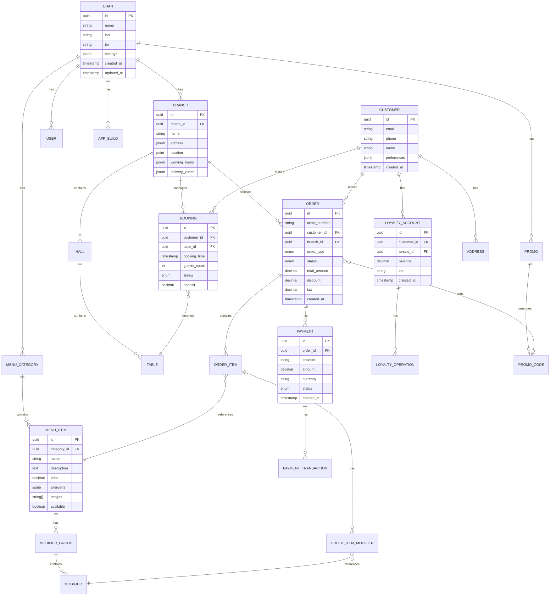
```mermaid
erDiagram
    TENANT ||--o{ BRANCH : has
    TENANT ||--o{ USER : has
    TENANT ||--o{ MENU_CATEGORY : has
    TENANT ||--o{ PROMO : has
    TENANT ||--o{ APP_BUILD : has
    
    BRANCH ||--o{ HALL : contains
    BRANCH ||--o{ ORDER : receives
    BRANCH ||--o{ BOOKING : manages
    
    HALL ||--o{ TABLE : contains
    
    CUSTOMER ||--o{ ORDER : places
    CUSTOMER ||--o{ BOOKING : makes
    CUSTOMER ||--o{ LOYALTY_ACCOUNT : has
    CUSTOMER ||--o{ ADDRESS : has
    
    MENU_CATEGORY ||--o{ MENU_ITEM : contains
    MENU_ITEM ||--o{ MODIFIER_GROUP : has
    MODIFIER_GROUP ||--o{ MODIFIER : contains
    
    ORDER ||--o{ ORDER_ITEM : contains
    ORDER ||--o{ PAYMENT : has
    ORDER_ITEM }o--|| MENU_ITEM : references
    ORDER_ITEM ||--o{ ORDER_ITEM_MODIFIER : has
    ORDER_ITEM_MODIFIER }o--|| MODIFIER : references
    
    PAYMENT ||--o{ PAYMENT_TRANSACTION : has
    
    LOYALTY_ACCOUNT ||--o{ LOYALTY_OPERATION : has
    
    PROMO ||--o{ PROMO_CODE : generates
    ORDER }o--o| PROMO_CODE : uses
    
    BOOKING }o--|| TABLE : reserves
    
    TENANT {
        uuid id PK
        string name
        string inn
        string tier
        jsonb settings
        timestamp created_at
        timestamp updated_at
    }
    
    BRANCH {
        uuid id PK
        uuid tenant_id FK
        string name
        jsonb address
        point location
        jsonb working_hours
        jsonb delivery_zones
    }
    
    CUSTOMER {
        uuid id PK
        string email
        string phone
        string name
        jsonb preferences
        timestamp created_at
    }
    
    ORDER {
        uuid id PK
        string order_number
        uuid customer_id FK
        uuid branch_id FK
        enum order_type
        enum status
        decimal total_amount
        decimal discount
        decimal tax
        timestamp created_at
    }
    
    MENU_ITEM {
        uuid id PK
        uuid category_id FK
        string name
        text description
        decimal price
        jsonb allergens
        string[] images
        boolean available
    }
    
    PAYMENT {
        uuid id PK
        uuid order_id FK
        string provider
        decimal amount
        string currency
        enum status
        timestamp created_at
    }
    
    LOYALTY_ACCOUNT {
        uuid id PK
        uuid customer_id FK
        uuid tenant_id FK
        decimal balance
        string tier
        timestamp created_at
    }
    
    BOOKING {
        uuid id PK
        uuid customer_id FK
        uuid table_id FK
        timestamp booking_time
        int guests_count
        enum status
        decimal deposit
    }
```

### 4.3 Требования к видам обеспечения

#### 4.3.1 Математическое обеспечение

- Использование стандартных моделей ценообразования, скидок, налогообложения (настраиваемые).
- Алгоритмы квот/таймслотов в пиковые нагрузки (очередь, приоритеты).
- Георасчет зон доставки (радиус/полигон), расчет стоимости доставки.

#### 4.3.2 Язык взаимодействия с пользователем

- Поддержка мультиязычности интерфейсов (минимум RU/EN; расширяемо).
- Данные хранятся в языке ввода; система поддерживает локализацию контента и шаблонов уведомлений.

#### 4.3.3 Требования к API

##### Структура API

```mermaid
graph TB
    subgraph Public API
        AUTH_API[Authentication API]
        MENU_API[Menu API]
        ORDER_API[Order API]
        CUSTOMER_API[Customer API]
        BOOKING_API[Booking API]
    end
    
    subgraph Partner API
        WEBHOOK_API[Webhook API]
        POS_API[POS Integration API]
        DELIVERY_API[Delivery API]
    end
    
    subgraph Admin API
        TENANT_API[Tenant Management API]
        ANALYTICS_API[Analytics API]
        CONFIG_API[Configuration API]
    end
    
    subgraph API Standards
        REST[REST]
        GRAPHQL[GraphQL]
        WEBSOCKET[WebSocket]
    end
    
    AUTH_API --> REST
    MENU_API --> REST & GRAPHQL
    ORDER_API --> REST & WEBSOCKET
    CUSTOMER_API --> REST
    BOOKING_API --> REST
    
    WEBHOOK_API --> REST
    POS_API --> REST
    DELIVERY_API --> REST
    
    TENANT_API --> REST
    ANALYTICS_API --> REST & GRAPHQL
    CONFIG_API --> REST
```

##### Основные эндпоинты API

**Authentication API:**
```
POST   /api/v1/auth/register
POST   /api/v1/auth/login
POST   /api/v1/auth/refresh
POST   /api/v1/auth/logout
POST   /api/v1/auth/verify-otp
POST   /api/v1/auth/reset-password
```

**Menu API:**
```
GET    /api/v1/branches/{branchId}/menu
GET    /api/v1/branches/{branchId}/menu/categories
GET    /api/v1/menu/items/{itemId}
GET    /api/v1/menu/search?q={query}
POST   /api/v1/menu/items (admin)
PUT    /api/v1/menu/items/{itemId} (admin)
DELETE /api/v1/menu/items/{itemId} (admin)
```

**Order API:**
```
POST   /api/v1/orders
GET    /api/v1/orders/{orderId}
GET    /api/v1/orders?status={status}&limit={limit}
PUT    /api/v1/orders/{orderId}/cancel
GET    /api/v1/orders/{orderId}/status
POST   /api/v1/orders/{orderId}/rate
```

**Payment API:**
```
POST   /api/v1/payments/init
POST   /api/v1/payments/webhook
GET    /api/v1/payments/{paymentId}/status
POST   /api/v1/payments/{paymentId}/refund (admin)
```

**Loyalty API:**
```
GET    /api/v1/loyalty/account
GET    /api/v1/loyalty/balance
GET    /api/v1/loyalty/operations
POST   /api/v1/loyalty/apply-promo
```

**Booking API:**
```
GET    /api/v1/branches/{branchId}/availability
POST   /api/v1/bookings
GET    /api/v1/bookings/{bookingId}
PUT    /api/v1/bookings/{bookingId}/cancel
```

##### Требования к API

- **Версионирование**: через URL путь (`/api/v1/`, `/api/v2/`)
- **Аутентификация**: JWT Bearer токены
- **Rate Limiting**: 
  - Public API: 100 запросов/минуту на IP
  - Authenticated: 1000 запросов/минуту на пользователя
  - Partner API: 5000 запросов/минуту
- **Формат ответов**: JSON, с полями:
  ```json
  {
    "success": true,
    "data": {},
    "meta": {
      "timestamp": "2024-01-01T12:00:00Z",
      "requestId": "uuid"
    }
  }
  ```
- **Обработка ошибок**: стандартные HTTP коды + детальное описание
  ```json
  {
    "success": false,
    "error": {
      "code": "VALIDATION_ERROR",
      "message": "Invalid input data",
      "details": [
        {"field": "email", "message": "Invalid email format"}
      ]
    },
    "meta": {
      "timestamp": "2024-01-01T12:00:00Z",
      "requestId": "uuid"
    }
  }
  ```
- **Пагинация**: cursor-based для больших наборов
  ```
  GET /api/v1/orders?limit=20&cursor=eyJpZCI6MTIzfQ==
  ```
- **Фильтрация и сортировка**:
  ```
  GET /api/v1/menu/items?category=pizza&sort=-price&available=true
  ```
- **Документация**: OpenAPI 3.0 спецификация, Swagger UI
- **SDK**: официальные SDK для JavaScript, Python, PHP
- **Webhooks**: подписка на события, retry механизм, HMAC подпись

## 5. Перечень стадий и этапов работ по созданию Платформы «MyCafe»

### 5.1 Организационные вопросы и инициация проекта

Подтверждение целей, границ, рисков, RACI. 

**Результат**: Устав проекта, план-график.

### 5.2 Предпроектное обследование

Анализ требований (SRS), интеграций, UX-референсов, сайзинг. 

**Результат**: Отчет обследования, согласованный SRS.

### 5.3 Техническое проектирование

Архитектура (логическая/физическая), модель данных, API (REST/GraphQL), безопасность, DevSecOps. 

**Результат**: Технический проект, спецификация API.

### 5.4 Дизайн и UX

Wireframes, дизайн-система, UI макеты для Web/Мобильных клиентов. 

**Результат**: UI Kit, кликабельные прототипы.

### 5.5 Разработка Backend

Аутентификация/авторизация, мультиарендность, сущности, заказы, платежи, лояльность, брони, интеграции, уведомления, аналитика, биллинг арендаторов, генератор приложений. 

**Результат**: Сервисы, миграции БД, тесты, документация.

### 5.6 Разработка Frontend/Web

- Панель ресторатора (Dashboard, меню, бренд, заказы, лояльность, брони, аналитика).
- Веб-клиент для посетителей (PWA). 

**Результат**: Web-приложения, тесты, инструкции.

### 5.7 Разработка Мобильных приложений

Клиент (iOS/Android), Сотрудник (iOS/Android), KDS. 

**Результат**: приложения, интеграция пушей, тесты.

### 5.8 Интеграции и публикации

- Платежные шлюзы, Push, POS/CRM, карты, SMS/email.
- Подготовка к публикации в App Store/Google Play (white-label). 

**Результат**: подключенные интеграции, материалы публикации.

### 5.9 Тестирование и качество

Unit/Integration, E2E, нагрузочное (целевой профиль), безопасность (SAST/DAST), соответствие SRS. 

**Результат**: отчеты по тестам, устраненные дефекты.

#### 5.9.1 Стратегия тестирования

```mermaid
graph TB
    subgraph Пирамида тестирования
        UI[E2E Tests<br/>~10%]
        INT[Integration Tests<br/>~30%]
        UNIT[Unit Tests<br/>~60%]
    end
    
    subgraph Виды тестирования
        FUNC[Функциональное]
        PERF[Производительность]
        SEC[Безопасность]
        COMPAT[Совместимость]
        USABILITY[Юзабилити]
        REGRESS[Регрессионное]
    end
    
    subgraph Инструменты
        JEST[Jest / Vitest]
        CYPRESS[Cypress / Playwright]
        POSTMAN[Postman / Newman]
        JMETER[JMeter / K6]
        SONAR[SonarQube]
        OWASP_ZAP[OWASP ZAP]
    end
    
    UNIT --> FUNC
    INT --> FUNC
    UI --> FUNC
    
    FUNC --> JEST
    FUNC --> CYPRESS
    FUNC --> POSTMAN
    
    PERF --> JMETER
    SEC --> SONAR
    SEC --> OWASP_ZAP
    
    COMPAT --> CYPRESS
    USABILITY --> CYPRESS
    REGRESS --> CYPRESS
```

#### 5.9.2 Уровни тестирования

##### Unit тестирование (60% покрытия)

- Тестирование отдельных функций и классов
- Моки внешних зависимостей
- Покрытие: минимум 80% для критичного кода
- Инструменты: Jest, Vitest, PyTest
- Запуск: при каждом commit (pre-commit hook)

**Примеры:**
- Расчет стоимости заказа
- Применение скидок и промокодов
- Валидация входных данных
- Бизнес-логика начисления бонусов

##### Integration тестирование (30%)

- Тестирование взаимодействия компонентов
- Реальные соединения с БД (test containers)
- Тестирование API эндпоинтов
- Инструменты: Postman, Newman, REST Assured

**Примеры:**
- Создание заказа через API
- Интеграция с платежной системой (mock)
- Синхронизация с POS системой
- Отправка уведомлений

##### E2E тестирование (10%)

- Тестирование полных пользовательских сценариев
- Реальные браузеры и мобильные устройства
- Критические пути (Critical User Journeys)
- Инструменты: Cypress, Playwright, Appium

**Примеры:**
- Полный цикл заказа: меню → корзина → оплата → трекинг
- Регистрация и вход пользователя
- Бронирование стола
- Работа с программой лояльности

#### 5.9.3 Нагрузочное тестирование

```mermaid
graph LR
    subgraph Типы нагрузки
        LOAD[Load Testing]
        STRESS[Stress Testing]
        SPIKE[Spike Testing]
        SOAK[Soak Testing]
    end
    
    subgraph Параметры
        RPS[Requests/sec]
        USERS[Concurrent Users]
        DURATION[Duration]
        RAMP_UP[Ramp-up Period]
    end
    
    subgraph Метрики
        LATENCY[Response Time]
        THROUGHPUT[Throughput]
        ERROR_RATE[Error Rate]
        RESOURCE[Resource Usage]
    end
    
    LOAD --> RPS
    STRESS --> RPS
    SPIKE --> USERS
    SOAK --> DURATION
    
    RPS --> LATENCY
    USERS --> THROUGHPUT
    DURATION --> ERROR_RATE
    RAMP_UP --> RESOURCE
```

##### Сценарии нагрузочного тестирования

**1. Load Testing (нормальная нагрузка)**
- Пользователи: 1000 одновременных
- Длительность: 30 минут
- Сценарий: просмотр меню, создание заказов, оплата
- Целевые метрики:
  - P50 latency < 300ms
  - P95 latency < 800ms
  - Error rate < 0.1%

**2. Stress Testing (пиковая нагрузка)**
- Пользователи: постепенное увеличение до отказа
- Цель: определить точку отказа системы
- Проверка автоскейлинга
- Проверка graceful degradation

**3. Spike Testing (внезапные скачки)**
- Моделирование: старт акции, lunch time peak
- Резкое увеличение нагрузки в 5-10 раз
- Проверка поведения очередей
- Проверка rate limiting

**4. Soak Testing (длительная работа)**
- Длительность: 24-48 часов
- Нормальная нагрузка
- Проверка утечек памяти
- Проверка накопления ошибок

#### 5.9.4 Тестирование безопасности

```mermaid
graph TB
    subgraph SAST - Static Analysis
        CODE_SCAN[Code Scanning]
        DEP_SCAN[Dependency Scanning]
        SECRET_SCAN[Secret Scanning]
    end
    
    subgraph DAST - Dynamic Analysis
        PENTEST[Penetration Testing]
        VULN_SCAN[Vulnerability Scanning]
        API_SEC[API Security Testing]
    end
    
    subgraph Проверки
        OWASP[OWASP Top 10]
        AUTH_TEST[Authentication Tests]
        AUTHZ_TEST[Authorization Tests]
        INJECTION[Injection Tests]
        XSS_TEST[XSS Tests]
        CSRF_TEST[CSRF Tests]
    end
    
    CODE_SCAN --> OWASP
    DEP_SCAN --> OWASP
    PENTEST --> OWASP
    
    VULN_SCAN --> INJECTION
    VULN_SCAN --> XSS_TEST
    API_SEC --> AUTH_TEST
    API_SEC --> AUTHZ_TEST
    API_SEC --> CSRF_TEST
```

##### Чек-лист безопасности

- [ ] SQL Injection защита
- [ ] XSS защита
- [ ] CSRF токены
- [ ] Rate limiting
- [ ] Input validation
- [ ] Output encoding
- [ ] Secure headers (CSP, HSTS, X-Frame-Options)
- [ ] JWT токены: signature verification, expiration
- [ ] Шифрование sensitive данных
- [ ] HTTPS enforcement
- [ ] Tenant isolation
- [ ] API authentication
- [ ] RBAC проверки
- [ ] Audit logging
- [ ] Dependency vulnerabilities

#### 5.9.5 Критерии приемки качества

| Метрика | Минимальное значение |
|---------|---------------------|
| Code Coverage | ≥ 80% для критичного кода |
| E2E Tests Pass Rate | 100% |
| API Uptime (staging) | ≥ 99% |
| P95 Latency | ≤ 800ms |
| Critical Bugs | 0 |
| High Priority Bugs | ≤ 5 |
| Security Vulnerabilities | 0 Critical, 0 High |
| SonarQube Quality Gate | Passed |
| Lighthouse Score (Web) | ≥ 90 |

### 5.10 Ввод в эксплуатацию

Подготовка инфраструктуры (prod), миграции, обучение, пилот. 

**Результат**: акт опытной эксплуатации.

#### 5.10.1 CI/CD Pipeline

```mermaid
graph LR
    subgraph Developer Workflow
        DEV[Developer] --> COMMIT[Commit]
        COMMIT --> PR[Pull Request]
    end
    
    subgraph CI Pipeline
        PR --> LINT[Linting]
        LINT --> UNIT_T[Unit Tests]
        UNIT_T --> BUILD[Build]
        BUILD --> SCAN[Security Scan]
        SCAN --> INT_T[Integration Tests]
    end
    
    subgraph Code Review
        INT_T --> REVIEW[Code Review]
        REVIEW --> APPROVE{Approved?}
        APPROVE -->|No| DEV
        APPROVE -->|Yes| MERGE[Merge to main]
    end
    
    subgraph CD Pipeline - Staging
        MERGE --> BUILD_STAGE[Build Image]
        BUILD_STAGE --> DEPLOY_STAGE[Deploy to Staging]
        DEPLOY_STAGE --> E2E[E2E Tests]
        E2E --> SMOKE[Smoke Tests]
    end
    
    subgraph CD Pipeline - Production
        SMOKE --> MANUAL{Manual Approval}
        MANUAL -->|Approved| DEPLOY_PROD[Deploy to Production]
        DEPLOY_PROD --> CANARY[Canary Deployment]
        CANARY --> MONITOR[Monitor Metrics]
        MONITOR --> SUCCESS{Success?}
        SUCCESS -->|Yes| ROLLOUT[Complete Rollout]
        SUCCESS -->|No| ROLLBACK[Automatic Rollback]
    end
    
    ROLLOUT --> DONE([Done])
    ROLLBACK --> ALERT[Alert Team]
    
    style DEPLOY_PROD fill:#FFE082
    style ROLLBACK fill:#FFAB91
```

#### 5.10.2 Environments

```mermaid
graph TB
    subgraph Development
        DEV_ENV[Dev Environment]
        DEV_DB[(Dev Database)]
        DEV_ENV --> DEV_DB
    end
    
    subgraph Testing
        TEST_ENV[Test Environment]
        TEST_DB[(Test Database)]
        TEST_ENV --> TEST_DB
    end
    
    subgraph Staging
        STAGE_ENV[Staging Environment]
        STAGE_DB[(Staging Database - Copy of Prod)]
        STAGE_CACHE[Redis]
        STAGE_QUEUE[Message Queue]
        STAGE_ENV --> STAGE_DB
        STAGE_ENV --> STAGE_CACHE
        STAGE_ENV --> STAGE_QUEUE
    end
    
    subgraph Production
        PROD_ENV[Production Environment]
        PROD_DB_PRIMARY[(Primary Database)]
        PROD_DB_REPLICA[(Read Replicas)]
        PROD_CACHE[Redis Cluster]
        PROD_QUEUE[Kafka Cluster]
        PROD_ENV --> PROD_DB_PRIMARY
        PROD_ENV --> PROD_DB_REPLICA
        PROD_ENV --> PROD_CACHE
        PROD_ENV --> PROD_QUEUE
    end
    
    DEV_ENV -.->|Promote| TEST_ENV
    TEST_ENV -.->|Promote| STAGE_ENV
    STAGE_ENV -.->|Release| PROD_ENV
    
    style PROD_ENV fill:#C5E1A5
```

#### 5.10.3 Deployment стратегии

##### Blue-Green Deployment

```mermaid
graph TB
    LB[Load Balancer]
    
    subgraph BLUE["Blue Environment - Current v1.0"]
        BLUE1[App Instance 1]
        BLUE2[App Instance 2]
        BLUE3[App Instance 3]
    end
    
    subgraph GREEN["Green Environment - New v2.0"]
        GREEN1[App Instance 1]
        GREEN2[App Instance 2]
        GREEN3[App Instance 3]
    end
    
    DB[(Database)]
    
    LB -->|100% traffic| BLUE1 & BLUE2 & BLUE3
    LB -.->|0% traffic| GREEN1 & GREEN2 & GREEN3
    
    BLUE1 & BLUE2 & BLUE3 --> DB
    GREEN1 & GREEN2 & GREEN3 -.-> DB
    
    style BLUE fill:#90CAF9
    style GREEN fill:#C5E1A5
    style DB fill:#FFE082
```

**Процесс Blue-Green развертывания:**
1. Deploy new version to Green environment
2. Test Green environment thoroughly
3. Switch traffic from Blue to Green
4. Keep Blue for quick rollback if needed

##### Canary Deployment

```mermaid
graph TB
    subgraph P1["Phase 1 - 5%"]
        LB1[Load Balancer]
        OLD1[Current Version]
        NEW1[New Version]
        LB1 -->|95%| OLD1
        LB1 -->|5%| NEW1
    end
    
    subgraph P2["Phase 2 - 25%"]
        LB2[Load Balancer]
        OLD2[Current Version]
        NEW2[New Version]
        LB2 -->|75%| OLD2
        LB2 -->|25%| NEW2
    end
    
    subgraph P3["Phase 3 - 50%"]
        LB3[Load Balancer]
        OLD3[Current Version]
        NEW3[New Version]
        LB3 -->|50%| OLD3
        LB3 -->|50%| NEW3
    end
    
    subgraph P4["Phase 4 - 100%"]
        LB4[Load Balancer]
        NEW4[New Version]
        LB4 -->|100%| NEW4
    end
    
    P1 -.->|Monitor metrics| P2
    P2 -.->|Monitor metrics| P3
    P3 -.->|Monitor metrics| P4
    
    style P1 fill:#E3F2FD
    style P2 fill:#BBDEFB
    style P3 fill:#90CAF9
    style P4 fill:#42A5F5
```

#### 5.10.4 Мониторинг и алертинг

```mermaid
graph TB
    subgraph Источники метрик
        APP[Application Metrics]
        INFRA[Infrastructure Metrics]
        LOG[Application Logs]
        TRACE[Distributed Traces]
        ERROR[Error Tracking]
    end
    
    subgraph Сбор данных
        PROM[Prometheus]
        LOKI[Loki]
        JAEGER[Jaeger]
        SENTRY[Sentry]
    end
    
    subgraph Визуализация
        GRAFANA[Grafana Dashboards]
        KIBANA[Kibana]
    end
    
    subgraph Алертинг
        ALERT_MANAGER[Alert Manager]
        PAGER[PagerDuty]
        SLACK[Slack]
        EMAIL[Email]
    end
    
    APP --> PROM
    INFRA --> PROM
    LOG --> LOKI
    TRACE --> JAEGER
    ERROR --> SENTRY
    
    PROM --> GRAFANA
    LOKI --> GRAFANA
    LOKI --> KIBANA
    JAEGER --> GRAFANA
    
    PROM --> ALERT_MANAGER
    ALERT_MANAGER --> PAGER
    ALERT_MANAGER --> SLACK
    ALERT_MANAGER --> EMAIL
```

#### 5.10.5 План миграции данных

1. **Подготовка:**
   - Аудит текущих данных
   - Определение схемы миграции
   - Создание mapping'ов полей
   - Подготовка скриптов миграции

2. **Тестирование:**
   - Миграция на тестовом окружении
   - Валидация данных
   - Тестирование производительности
   - Rollback процедуры

3. **Миграция:**
   - Backup production данных
   - Maintenance mode
   - Запуск миграции
   - Валидация результатов
   - Снятие maintenance mode

4. **Мониторинг:**
   - Отслеживание метрик
   - Проверка целостности данных
   - Готовность к rollback

5. **Rollback план:**
   - Условия для rollback
   - Процедура отката
   - Восстановление из backup
   - Уведомление stakeholders

### 5.11 Приемочные испытания и релиз

По ГОСТ 34.603-92: предварительные, опытная эксплуатация, приемочные. 

**Результат**: протоколы испытаний, акт приемки, релиз.

### 5.12 Сроки

- **MVP** (ядро: меню, заказы, оплата, клиент Web/PWA, панель ресторатора, базовые уведомления) — до 3 месяцев.
- **Полный релиз** (мобильные iOS/Android, лояльность, брони, KDS, интеграции, аналитика, white-label генератор) — до 6 месяцев.

## 6. Порядок контроля и приемки

Испытания: предварительные (на стенде Исполнителя), опытная эксплуатация (на окружении Заказчика/облачном), приемочные (комиссией).

Проверяется: полнота функций, соответствие SRS/ТЗ, производительность, устойчивость, безопасность, UX-соответствие макетам, готовность документов и обучающих материалов.

В случае выявления несоответствий — оформление протокола с дефектами и сроками устранения, повторная приемка.

## 7. Подготовка к вводу в действие

- Назначение ответственных, согласование регламентов эксплуатации.
- Подготовка инфраструктуры (CI/CD, мониторинг, бэкапы).
- Импорт/заведение первоначальных данных (меню, филиалы, залы).
- Обучение пользователей (видеоуроки, воркшопы).
- Пилот на ограниченной группе ресторанов, корректировки.

### 7.1 План обучения пользователей

#### 7.1.1 Целевые аудитории

```mermaid
graph TB
    subgraph Владельцы ресторанов
        OWNER_BASIC[Базовое обучение - 4 часа]
        OWNER_ADV[Продвинутое - 2 часа]
        OWNER_CERT[Сертификация - 1 час]
    end
    
    subgraph Персонал
        STAFF_WAITER[Официанты - 2 часа]
        STAFF_COOK[Повара / KDS - 1 час]
        STAFF_MANAGER[Менеджеры - 3 часа]
    end
    
    subgraph Технические специалисты
        TECH_INT[Интеграции - 4 часа]
        TECH_API[API разработка - 6 часов]
    end
    
    OWNER_BASIC --> OWNER_ADV
    OWNER_ADV --> OWNER_CERT
    
    STAFF_WAITER --> STAFF_MANAGER
    STAFF_COOK --> STAFF_MANAGER
```

#### 7.1.2 Программа обучения владельцев

**Модуль 1: Введение (30 мин)**
- Обзор платформы
- Возможности и преимущества
- Основные концепции (мультиарендность, white-label)

**Модуль 2: Первоначальная настройка (60 мин)**
- Регистрация и настройка аккаунта
- Создание филиалов
- Настройка рабочего времени и зон доставки
- Управление пользователями и ролями

**Модуль 3: Управление меню (60 мин)**
- Создание категорий
- Добавление блюд
- Настройка модификаторов
- Загрузка изображений
- Управление доступностью

**Модуль 4: Брендинг приложения (45 мин)**
- Загрузка логотипа и иконок
- Настройка цветовой схемы
- Выбор шрифтов
- Настройка экранов
- Генерация приложений

**Модуль 5: Программа лояльности (45 мин)**
- Настройка правил начисления
- Создание уровней лояльности
- Генерация промокодов
- Отслеживание эффективности

**Модуль 6: Аналитика и отчеты (30 мин)**
- Обзор дашбордов
- Основные метрики
- Экспорт данных
- Настройка отчетов

**Модуль 7: Интеграции (30 мин)**
- Подключение платежных систем
- Интеграция с POS
- Настройка уведомлений
- API ключи

#### 7.1.3 Программа обучения персонала

**Для официантов:**
- Вход в приложение персонала
- Просмотр заказов
- Управление столами
- Пересадка гостей
- Закрытие счетов
- QR-заказы

**Для поваров (KDS):**
- Работа с кухонным дисплеем
- Обновление статусов заказов
- Приоритизация заказов
- Уведомления о новых заказах

**Для менеджеров:**
- Мониторинг операций в реальном времени
- Управление бронированиями
- Отчеты за смену
- Решение конфликтных ситуаций

#### 7.1.4 Формат обучения

```mermaid
graph LR
    subgraph Онлайн
        VIDEO[Видеоуроки]
        WEBINAR[Вебинары]
        DOC[Документация]
        KB[База знаний]
    end
    
    subgraph Оффлайн
        WORKSHOP[Воркшопы]
        ONSITE[Обучение на месте]
        CONSULT[Консультации]
    end
    
    subgraph Поддержка
        CHAT[Чат поддержки]
        EMAIL_SUP[Email]
        PHONE[Телефон]
        TICKET[Система тикетов]
    end
    
    VIDEO --> WEBINAR
    WEBINAR --> WORKSHOP
    DOC --> KB
    
    WORKSHOP --> ONSITE
    ONSITE --> CONSULT
    
    VIDEO & DOC & KB --> CHAT
    CHAT --> EMAIL_SUP
    EMAIL_SUP --> TICKET
```

### 7.2 Материалы обучения

- [ ] Видеоуроки (всего: 15 видео, ~3 часа)
- [ ] Интерактивные демо-аккаунты
- [ ] PDF-гайды для скачивания
- [ ] Инфографика и чек-листы
- [ ] FAQ база (минимум 100 вопросов)
- [ ] Онлайн-тесты для проверки знаний
- [ ] Сертификаты о прохождении обучения

## 8. Гарантийная поддержка

Не менее 12 месяцев с даты ввода в промышленную эксплуатацию.

Включает: устранение дефектов, минорные обновления безопасности, консультации 24/7 по инцидентам P1/P2, поддержка публикаций в сторах для white-label.

Целевые сроки реакции/восстановления:

- **P1** — реакция ≤ 1 час, восстановление ≤ 8 часов
- **P2** — реакция ≤ 4 часа, восстановление ≤ 24 часов

(уточняются в SLA).

## 9. Требования к документированию

По ГОСТ 34 и внутренним стандартам Заказчика.

### Состав документации:

- Спецификация системы.
- Описание архитектуры и схемы БД.
- Описание API (OpenAPI/GraphQL schema), гайды по интеграциям и webhooks.
- Руководство по установке/развертыванию (инфраструктура, CI/CD).
- Руководство администратора Платформы.
- Руководство ресторатора (панель управления).
- Руководство персонала (официант/кассир/повар/KDS).
- Руководство пользователя Клиента.
- Программа и методика испытаний.
- Политики ИБ и приватности (шаблоны согласий, обработка ПДн).

Формат: электронный (PDF/HTML) и по требованию — печатный.

## 10. Нефункциональные требования (сводно)

- **Производительность**: базовый ориентир для масштабирования — поддержка суммарно не менее 1 000 одновременных оформлений заказов/минуту на уровне Платформы (масштабируемо горизонтально). Латентность основных API P50 ≤ 300 мс, P95 ≤ 800 мс при целевом профиле нагрузки.
- **Доступность**: SLA 99.5%+ (исключая объявленные окна обслуживания).
- **Совместимость**: современные версии Chrome, Safari, Firefox, Edge; iOS/Android в актуальных двух основных версиях.
- **Логи и мониторинг**: централизованный сбор логов, метрик, алертинг, трассировка (distributed tracing).
- **Конфиденциальность**: минимизация данных, псевдонимизация/маскирование, хранение секретов в KMS.
- **Масштабируемость**: автоскейлинг сервисов, очередей, кэшей; раздельные пулы под фоновые задачи.

### 10.1 Схема развертывания инфраструктуры

```mermaid
graph TB
    subgraph Internet
        USERS[Пользователи]
    end
    
    subgraph CDN / Edge Layer
        CDN[CDN]
        STATIC[Static Assets]
    end
    
    subgraph Security Layer
        WAF[WAF]
        DDOS[DDoS Protection]
    end
    
    subgraph Load Balancing
        LB_PUBLIC[Public Load Balancer]
        LB_INTERNAL[Internal Load Balancer]
    end
    
    subgraph Application Layer - Zone A
        API_A1[API Gateway Pod 1]
        API_A2[API Gateway Pod 2]
        
        SERVICE_A1[Service Pods]
        SERVICE_A2[Service Pods]
    end
    
    subgraph Application Layer - Zone B
        API_B1[API Gateway Pod 3]
        API_B2[API Gateway Pod 4]
        
        SERVICE_B1[Service Pods]
        SERVICE_B2[Service Pods]
    end
    
    subgraph Cache Layer
        REDIS_MASTER[Redis Master]
        REDIS_REPLICA[Redis Replicas]
    end
    
    subgraph Message Queue
        KAFKA[Kafka Cluster]
        QUEUE[Message Queues]
    end
    
    subgraph Database Layer
        DB_PRIMARY[(Primary Database)]
        DB_REPLICA1[(Read Replica 1)]
        DB_REPLICA2[(Read Replica 2)]
    end
    
    subgraph Storage
        S3[Object Storage S3]
        BACKUP[(Backup Storage)]
    end
    
    subgraph Monitoring & Logging
        PROMETHEUS[Prometheus]
        GRAFANA[Grafana]
        ELK[ELK Stack]
        JAEGER[Jaeger Tracing]
    end
    
    subgraph External Services
        PAYMENT_GW[Payment Gateways]
        PUSH_SVC[Push Services]
        SMS_SVC[SMS Gateway]
    end
    
    USERS --> CDN
    USERS --> WAF
    CDN --> STATIC
    WAF --> DDOS
    DDOS --> LB_PUBLIC
    
    LB_PUBLIC --> API_A1 & API_A2
    LB_PUBLIC --> API_B1 & API_B2
    
    API_A1 & API_A2 --> LB_INTERNAL
    API_B1 & API_B2 --> LB_INTERNAL
    
    LB_INTERNAL --> SERVICE_A1 & SERVICE_A2
    LB_INTERNAL --> SERVICE_B1 & SERVICE_B2
    
    SERVICE_A1 & SERVICE_A2 & SERVICE_B1 & SERVICE_B2 --> REDIS_MASTER
    REDIS_MASTER --> REDIS_REPLICA
    
    SERVICE_A1 & SERVICE_A2 & SERVICE_B1 & SERVICE_B2 --> KAFKA
    KAFKA --> QUEUE
    
    SERVICE_A1 & SERVICE_A2 & SERVICE_B1 & SERVICE_B2 --> DB_PRIMARY
    SERVICE_A1 & SERVICE_A2 & SERVICE_B1 & SERVICE_B2 --> DB_REPLICA1
    SERVICE_A1 & SERVICE_A2 & SERVICE_B1 & SERVICE_B2 --> DB_REPLICA2
    
    DB_PRIMARY --> DB_REPLICA1 & DB_REPLICA2
    DB_PRIMARY --> BACKUP
    
    SERVICE_A1 & SERVICE_A2 & SERVICE_B1 & SERVICE_B2 --> S3
    
    SERVICE_A1 & SERVICE_A2 & SERVICE_B1 & SERVICE_B2 --> PAYMENT_GW
    SERVICE_A1 & SERVICE_A2 & SERVICE_B1 & SERVICE_B2 --> PUSH_SVC
    SERVICE_A1 & SERVICE_A2 & SERVICE_B1 & SERVICE_B2 --> SMS_SVC
    
    SERVICE_A1 & SERVICE_A2 & SERVICE_B1 & SERVICE_B2 -.-> PROMETHEUS
    SERVICE_A1 & SERVICE_A2 & SERVICE_B1 & SERVICE_B2 -.-> ELK
    SERVICE_A1 & SERVICE_A2 & SERVICE_B1 & SERVICE_B2 -.-> JAEGER
    
    PROMETHEUS --> GRAFANA
    
    style DB_PRIMARY fill:#FFE082
    style REDIS_MASTER fill:#C5E1A5
    style KAFKA fill:#90CAF9
```

### 10.2 Метрики производительности

```mermaid
graph LR
    subgraph Целевые метрики
        A[API Latency P50 < 300ms]
        B[API Latency P95 < 800ms]
        C[Throughput > 1000 заказов/мин]
        D[Database queries < 100ms]
        E[Cache hit rate > 90%]
        F[Error rate < 0.1%]
        G[Availability > 99.5%]
    end
    
    subgraph Мониторинг
        M1[Prometheus Metrics]
        M2[Grafana Dashboards]
        M3[Alerting Rules]
    end
    
    subgraph Автоскейлинг
        S1[HPA - CPU > 70%]
        S2[HPA - Memory > 80%]
        S3[HPA - Custom metrics]
    end
    
    A & B & C & D & E & F & G --> M1
    M1 --> M2
    M1 --> M3
    M3 --> S1 & S2 & S3
```

## 11. Управление рисками проекта

### 11.1 Матрица рисков

```mermaid
graph TB
    subgraph Критические риски - Красная зона
        R1[Утечка данных клиентов]
        R2[Недоступность платежей]
        R3[Потеря данных БД]
    end
    
    subgraph Высокие риски - Оранжевая зона
        R4[Проблемы с производительностью]
        R5[Сбои интеграций с POS]
        R6[Превышение сроков разработки]
        R7[Проблемы с публикацией в сторах]
    end
    
    subgraph Средние риски - Желтая зона
        R8[Изменение требований]
        R9[Недостаточное качество кода]
        R10[Проблемы с масштабированием]
    end
    
    subgraph Низкие риски - Зеленая зона
        R11[Задержки в обучении]
        R12[Незначительные баги UI]
    end
    
    style R1 fill:#FFCDD2
    style R2 fill:#FFCDD2
    style R3 fill:#FFCDD2
    style R4 fill:#FFE082
    style R5 fill:#FFE082
    style R6 fill:#FFE082
    style R7 fill:#FFE082
```

### 11.2 Детальный анализ рисков

| ID | Риск | Вероятность | Влияние | Приоритет | Митигация | Владелец |
|----|------|------------|---------|-----------|-----------|----------|
| R1 | Утечка данных клиентов | Низкая | Критическое | Высокий | - Шифрование данных<br/>- Регулярные security аудиты<br/>- SAST/DAST<br/>- Обучение команды | Security Lead |
| R2 | Недоступность платежей | Средняя | Критическое | Высокий | - Несколько платежных провайдеров<br/>- Fallback механизмы<br/>- Мониторинг 24/7<br/>- SLA с провайдерами | Tech Lead |
| R3 | Потеря данных БД | Очень низкая | Критическое | Высокий | - Ежедневные бэкапы<br/>- Point-in-time recovery<br/>- Репликация<br/>- DR план | DevOps Lead |
| R4 | Проблемы с производительностью | Средняя | Высокое | Средний | - Нагрузочное тестирование<br/>- Кэширование<br/>- Оптимизация запросов<br/>- Автоскейлинг | Tech Lead |
| R5 | Сбои интеграций с POS | Высокая | Высокое | Высокий | - Retry механизмы<br/>- Очереди сообщений<br/>- Мониторинг интеграций<br/>- Документация API | Integration Lead |
| R6 | Превышение сроков | Средняя | Высокое | Средний | - Agile методология<br/>- Еженедельные ревью<br/>- MVP подход<br/>- Резервы в планировании | PM |
| R7 | Проблемы с публикацией в сторах | Средняя | Среднее | Средний | - Ранняя подача заявки<br/>- Соблюдение гайдлайнов<br/>- Тестовые аккаунты<br/>- Контакты в Apple/Google | Mobile Lead |
| R8 | Изменение требований | Высокая | Среднее | Средний | - Change control процесс<br/>- Приоритизация<br/>- Согласование с заказчиком | PM |
| R9 | Недостаточное качество кода | Средняя | Среднее | Средний | - Code review<br/>- Автотесты (80%+ coverage)<br/>- SonarQube<br/>- Coding standards | Tech Lead |
| R10 | Проблемы с масштабированием | Низкая | Среднее | Низкий | - Микросервисная архитектура<br/>- Horizontal scaling<br/>- Load testing<br/>- Capacity planning | Architect |
| R11 | Задержки в обучении | Средняя | Низкое | Низкий | - Ранняя подготовка материалов<br/>- Интуитивный UI<br/>- In-app подсказки | PM |
| R12 | Незначительные баги UI | Высокая | Низкое | Низкий | - UX тестирование<br/>- Beta тестирование<br/>- Быстрые hotfix релизы | QA Lead |

### 11.3 План реагирования на инциденты

```mermaid
graph TB
    INCIDENT[Инцидент обнаружен] --> SEVERITY{Определение<br/>серьезности}
    
    SEVERITY -->|P1 - Critical| P1_RESPONSE[Немедленная эскалация]
    SEVERITY -->|P2 - High| P2_RESPONSE[Эскалация в течение 1 часа]
    SEVERITY -->|P3 - Medium| P3_RESPONSE[Обработка в рабочее время]
    SEVERITY -->|P4 - Low| P4_RESPONSE[Запланировать на спринт]
    
    P1_RESPONSE --> WAR_ROOM[War Room]
    WAR_ROOM --> INVESTIGATE[Расследование]
    INVESTIGATE --> MITIGATE[Митигация]
    MITIGATE --> RESOLVE[Решение]
    RESOLVE --> POSTMORTEM[Post-mortem]
    
    P2_RESPONSE --> ASSIGN[Назначить ответственного]
    ASSIGN --> FIX[Исправление]
    FIX --> DEPLOY[Деплой hotfix]
    
    P3_RESPONSE --> BACKLOG[В backlog]
    P4_RESPONSE --> BACKLOG
    
    POSTMORTEM --> IMPROVE[Улучшение процессов]
    
    style P1_RESPONSE fill:#FFCDD2
    style WAR_ROOM fill:#FFCDD2
```

### 11.4 Критерии серьезности инцидентов

**P1 - Critical (Критический):**
- Полная недоступность системы
- Утечка данных
- Невозможность принимать платежи
- Массовые финансовые потери
- **SLA:** Время реакции ≤ 15 мин, восстановление ≤ 1 час

**P2 - High (Высокий):**
- Частичная недоступность функционала
- Критические баги, блокирующие работу
- Проблемы с производительностью
- Проблемы с интеграциями
- **SLA:** Время реакции ≤ 1 час, восстановление ≤ 4 часа

**P3 - Medium (Средний):**
- Некритические баги
- Незначительные проблемы с UX
- Проблемы с отчетами
- **SLA:** Время реакции ≤ 8 часов, восстановление ≤ 2 дня

**P4 - Low (Низкий):**
- Косметические баги
- Предложения по улучшению
- Документация
- **SLA:** Обработка в рамках следующего спринта

## 12. Рекомендуемый технический стек

### 12.1 Backend

```mermaid
graph TB
    subgraph Язык и фреймворк
        NODEJS[Node.js + TypeScript]
        NESTJS[NestJS / Express]
        ALT1[Альт: Python + FastAPI]
        ALT2[Альт: Go + Gin/Echo]
    end
    
    subgraph База данных
        POSTGRES[PostgreSQL 14+]
        REDIS[Redis 7+]
        MONGO[MongoDB - для логов]
    end
    
    subgraph Очереди и события
        KAFKA[Apache Kafka]
        REDIS_QUEUE[Bull Queue - Redis]
    end
    
    subgraph Поиск
        ELASTIC[Elasticsearch]
        TYPESENSE[Typesense]
    end
    
    NODEJS --> NESTJS
    NODEJS -.-> ALT1
    NODEJS -.-> ALT2
    
    NESTJS --> POSTGRES
    NESTJS --> REDIS
    NESTJS --> MONGO
    NESTJS --> KAFKA
    NESTJS --> ELASTIC
```

**Основной стек:**
- **Runtime**: Node.js 20+ LTS
- **Язык**: TypeScript 5+
- **Framework**: NestJS (рекомендуется) или Express
- **БД**: PostgreSQL 14+ (основная), Redis 7+ (кэш/сессии)
- **ORM**: Prisma или TypeORM
- **Валидация**: class-validator, Zod
- **Очереди**: BullMQ + Redis или Apache Kafka
- **Логирование**: Winston, Pino
- **Тестирование**: Jest, Supertest

**Альтернативные варианты:**
- Python 3.11+ + FastAPI + SQLAlchemy
- Go 1.21+ + Gin/Echo + GORM

### 12.2 Frontend

```mermaid
graph TB
    subgraph Web приложения
        REACT[React 18+ / Next.js]
        VUE[Alt: Vue 3 + Nuxt]
    end
    
    subgraph Mobile
        REACT_NATIVE[React Native]
        FLUTTER[Alt: Flutter]
    end
    
    subgraph UI библиотеки
        MUI[Material-UI]
        TAILWIND[Tailwind CSS]
        SHADCN[shadcn/ui]
    end
    
    subgraph State Management
        ZUSTAND[Zustand]
        REDUX[Redux Toolkit]
        REACT_QUERY[TanStack Query]
    end
    
    REACT --> MUI
    REACT --> TAILWIND
    REACT --> ZUSTAND
    REACT --> REACT_QUERY
    
    REACT_NATIVE --> TAILWIND
    REACT_NATIVE --> ZUSTAND
```

**Web (Клиент и Админ панель):**
- **Framework**: React 18+ с Next.js 14+ (App Router)
- **Язык**: TypeScript
- **UI**: Material-UI v5 или Tailwind CSS + shadcn/ui
- **State**: Zustand + TanStack Query (React Query)
- **Формы**: React Hook Form + Zod
- **Графики**: Recharts, Chart.js
- **Карты**: Leaflet, Google Maps API
- **Тестирование**: Vitest, Testing Library, Playwright

**Альтернатива:**
- Vue 3 + Nuxt 3 + Pinia + Vuetify

**Mobile (iOS/Android):**
- **Framework**: React Native 0.73+
- **Navigation**: React Navigation
- **UI**: React Native Paper или NativeBase
- **State**: Zustand + TanStack Query
- **Push**: React Native Firebase
- **Тестирование**: Jest, Detox

**Альтернатива:**
- Flutter 3.16+ + Riverpod + Firebase

### 12.3 DevOps и инфраструктура

```mermaid
graph TB
    subgraph Контейнеризация
        DOCKER[Docker]
        K8S[Kubernetes]
        HELM[Helm Charts]
    end
    
    subgraph CI/CD
        GITHUB[GitHub Actions]
        GITLAB[Alt: GitLab CI]
    end
    
    subgraph Облако
        AWS[AWS]
        GCP[Alt: Google Cloud]
        AZURE[Alt: Azure]
    end
    
    subgraph Мониторинг
        PROM[Prometheus]
        GRAF[Grafana]
        LOKI_TOOL[Loki]
        JAEG[Jaeger]
    end
    
    DOCKER --> K8S
    K8S --> HELM
    
    GITHUB --> K8S
    
    K8S --> AWS
    AWS --> PROM
    PROM --> GRAF
    LOKI_TOOL --> GRAF
    JAEG --> GRAF
```

**Контейнеризация:**
- Docker
- Kubernetes (EKS, GKE или AKS)
- Helm для управления релизами

**CI/CD:**
- GitHub Actions (рекомендуется)
- Альт: GitLab CI/CD, CircleCI

**Облачная платформа:**
- AWS (рекомендуется): EKS, RDS, ElastiCache, S3, CloudFront
- Альт: Google Cloud Platform, Microsoft Azure
- Managed Kubernetes или самостоятельно управляемый кластер

**Мониторинг и логирование:**
- Prometheus + Grafana (метрики)
- Loki (логи)
- Jaeger (трассировка)
- Sentry (ошибки)
- DataDog / New Relic (опционально)

**Инфраструктура как код:**
- Terraform
- Ansible (конфигурация)

### 12.4 Безопасность

**Инструменты:**
- SonarQube (статический анализ кода)
- OWASP ZAP (тестирование безопасности)
- Trivy (сканирование контейнеров)
- Vault (управление секретами)
- Let's Encrypt (SSL сертификаты)

### 12.5 Дополнительные сервисы

**Платежи:**
- Stripe
- PayPal
- ЮKassa (для РФ)
- Tinkoff Acquiring

**Уведомления:**
- Firebase Cloud Messaging (Push)
- Twilio (SMS)
- SendGrid / Mailgun (Email)

**Аналитика:**
- Google Analytics 4
- Mixpanel / Amplitude (продуктовая аналитика)

**Мониторинг доступности:**
- UptimeRobot
- Pingdom

## 13. Приложения

### 13.1 Примеры API запросов

**Создание заказа:**
```http
POST /api/v1/orders
Authorization: Bearer {jwt_token}
Content-Type: application/json

{
  "branchId": "550e8400-e29b-41d4-a716-446655440000",
  "type": "delivery",
  "items": [
    {
      "menuItemId": "660e8400-e29b-41d4-a716-446655440001",
      "quantity": 2,
      "modifiers": [
        {
          "modifierId": "770e8400-e29b-41d4-a716-446655440002",
          "quantity": 1
        }
      ]
    }
  ],
  "deliveryAddress": {
    "street": "Тверская",
    "building": "12",
    "apartment": "45",
    "floor": 5,
    "entrance": 2
  },
  "deliveryTime": "2024-12-01T18:30:00Z",
  "promoCode": "WELCOME10",
  "loyaltyPoints": 50,
  "comment": "Позвоните за 10 минут"
}
```

**Ответ:**
```json
{
  "success": true,
  "data": {
    "orderId": "880e8400-e29b-41d4-a716-446655440003",
    "orderNumber": "R-2024-1234",
    "status": "pending_payment",
    "totalAmount": 1250.00,
    "discount": 125.00,
    "loyaltyDiscount": 50.00,
    "finalAmount": 1075.00,
    "paymentUrl": "https://payment.provider.com/pay/xyz123",
    "estimatedDeliveryTime": "2024-12-01T18:30:00Z"
  },
  "meta": {
    "timestamp": "2024-12-01T17:00:00Z",
    "requestId": "req_abc123"
  }
}
```

### 13.2 Примеры webhook событий

**Изменение статуса заказа:**
```json
{
  "eventType": "order.status_changed",
  "eventId": "evt_123456",
  "timestamp": "2024-12-01T17:05:00Z",
  "data": {
    "orderId": "880e8400-e29b-41d4-a716-446655440003",
    "previousStatus": "pending_payment",
    "currentStatus": "confirmed",
    "changedBy": "system",
    "reason": "payment_received"
  },
  "signature": "sha256=abc123def456..."
}
```

## Примечания

- Окончательные показатели производительности и доступности уточняются по результатам нагрузки и пилота и фиксируются в SLA.
- Все интеграции с платежами реализуются с переносом зоны ответственности по карточным данным на провайдера (редирект/хостед формы), если не предусмотрен иной согласованный вариант с соблюдением PCI DSS.
- Данное техническое задание является живым документом и может обновляться по мере развития проекта с согласованием всех заинтересованных сторон.
- Выбор конкретных технологий из рекомендуемого стека остается за Исполнителем при условии соблюдения всех функциональных и нефункциональных требований.
