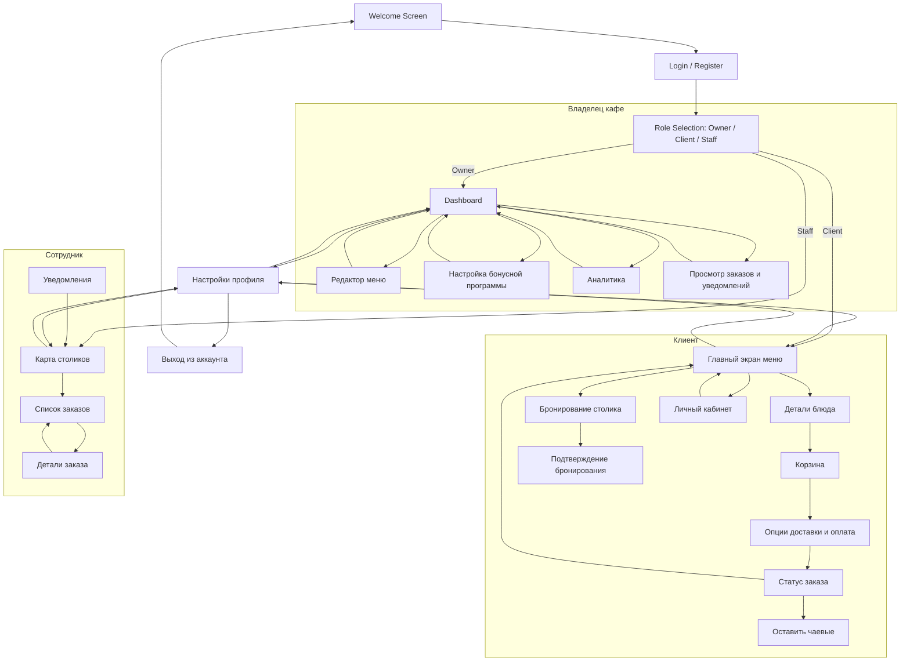

# Описание структуры экранов MyCafe

Приложение разделено на три основных пользовательских потока — для владельца кафе, клиента и сотрудника — с общим экраном приветствия и авторизации.

---

## 1. Экран приветствия и авторизации  
Пользователь попадает на экран приветствия (Welcome Screen), откуда переходит на экран входа или регистрации (Login/Register). После успешной авторизации пользователь выбирает свою роль: владелец, клиент или сотрудник.

---

## 2. Поток Владельца кафе  
После выбора роли **Владелец** пользователь попадает на панель управления (Dashboard), где доступны основные функции:

- Редактор меню (создание и изменение меню заведения)
- Настройка бонусной программы (правила начисления и управления лояльностью)
- Аналитика (просмотр ключевых показателей и отчетов)
- Просмотр заказов и уведомлений (мониторинг текущих заказов)

Из любой из этих секций можно вернуться на главный дашборд

---

## 3. Поток Клиента  
Клиент после выбора роли попадает на главный экран с меню заведения (Главный экран меню), откуда может:

- Просмотреть детали блюда
- Добавить блюда в корзину и перейти к опциям доставки и оплате
- Отслеживать статус заказа в реальном времени
- Оставить чаевые после оплаты
- Забронировать столик и получить подтверждение бронирования
- Перейти в личный кабинет для просмотра информации и управления профилем

Клиент может навигировать между этими экранами и возвращаться к меню

---

## 4. Поток Сотрудника  
Сотрудник попадает на экран карты столиков, где отображаются статусы мест. Отсюда можно перейти к списку заказов и деталям конкретного заказа. Также сотрудник получает уведомления о новых заказах или изменениях.

---

## 5. Общие экраны  
Все три роли имеют доступ к настройкам профиля. После выхода пользователь возвращается на экран приветствия.

---

## Итог  
Эта структура обеспечивает понятную навигацию и разграничение функционала по ролям, при этом все важные операции доступны в пределах своих потоков с возможностью возврата к главному экрану и общим настройкам.

## Диаграмма Активностей

## Ссылка на wireframe-макеты

  - Link - https://ninjamock.com/s/3QZ6QZx