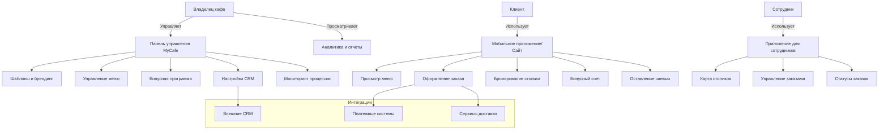

### **Спецификация требований к программному обеспечению (SRS)**
**Проект:** MyCafe — No-code платформа для создания мобильных приложений и веб-сайтов для ресторанов и кафе
* **Версия:** 1.0
* **Дата:** 03.10.2025

---

### **1. Общее описание**

#### **1.1. Введение**
Настоящий документ описывает функциональные и нефункциональные требования, а также варианты использования к No-code платформе **MyCafe**. Платформа предназначена для автоматизации бизнес-процессов заведений общественного питания (кафе, ресторанов, баров) путем предоставления им готовых, настраиваемых решений: мобильного приложения, веб-сайта и панели управления, без необходимости программирования.

#### **1.2. Видение продукта**
MyCafe призвана демократизировать доступ к цифровым технологиям для малого и среднего бизнеса в сфере HoReCa. В отличие от сложных универсальных No-code платформ и дорогостоящих индивидуальных решений, MyCafe предлагает специализированный, интуитивно понятный инструмент, который позволяет владельцу заведения в кратчайшие сроки (буквально за один вечер) получить полнофункциональный цифровой продукт для взаимодействия с клиентами и управления внутренними процессами.

#### **1.3. Целевая аудитория**
*   **Владельцы кафе и ресторанов:** Основные пользователи, которые будут настраивать и администрировать систему.
*   **Персонал заведения:** Официанты, менеджеры, повара — будут использовать специализированное приложение для сотрудников.
*   **Конечные клиенты:** Посетители заведения, которые будут использовать мобильное приложение или сайт для заказов, бронирования и участия в бонусной программе.

#### **1.4. Предположения и зависимости**
*   Пользователь (владелец заведения) имеет базовые навыки работы с компьютером и веб-браузером.
*   Для публикации приложения в официальных магазинах приложений (App Store, Google Play) потребуется наличие аккаунтов разработчика, которые пользователь оформляет самостоятельно.
*   Платформа зависит от сторонних сервисов для пуш-уведомлений, хостинга и, опционально, платежных шлюзов.

---

### **2. Функциональные требования (Functional Requirements)**

#### **FR1: Управление шаблонами и брендингом**
*   **FR1.1:** Система должна предоставлять библиотеку готовых, адаптивных шаблонов для мобильного приложения и веб-сайта.
*   **FR1.2:** Система должна позволять пользователю загружать логотип, фотографии заведения и блюд.
*   **FR1.3:** Система должна автоматически применять выбранный брендинг (логотип, цвета) ко всем генерируемым артефактам (приложение, сайт).

#### **FR2: Управление меню и контентом**
*   **FR2.1:** Система должна предоставлять визуальный редактор для создания и редактирования меню.
*   **FR2.2:** Система должна позволять для каждой позиции меню указывать: название, описание, цену, категорию, изображение, состав, аллергены, КБЖУ (калории, белки, жиры, углеводы).
*   **FR2.3:** Система должна предоставлять панель управления для оперативного обновления меню (изменение цен, наличие/отсутствие позиций).

#### **FR3: Бонусная программа и управление лояльностью**
*   **FR3.1:** Система должна автоматически активировать бонусную программу после настройки.
*   **FR3.2:** Система должна позволять администратору назначать правила начисления бонусов (например, N бонусов за каждые X потраченных рублей/долларов).
*   **FR3.3:** Система должна предоставлять клиенту личный кабинет в приложении для отслеживания накопленных и списанных бонусов.

#### **FR4: Функционал для клиентов (через приложение/сайт)**
*   **FR4.1:** Система должна позволять клиенту просматривать меню, добавлять блюда в корзину и оформлять заказы (с доставкой, самовывозом или "доставкой до стола").
*   **FR4.2:** Система должна предоставлять функционал онлайн-бронирования столиков с выбором даты, времени и количества гостей.
*   **FR4.3:** Система должна интегрировать систему чаевых, позволяя клиенту оставить чаевые сотруднику после оплаты заказа.
*   **FR4.4:** Система должна отображать статус заказа в реальном времени для клиента.

#### **FR5: Приложение для сотрудников и CRM**
*   **FR5.1:** Система должна предоставлять отдельное приложение для сотрудников с авторизацией.
*   **FR5.2:** Приложение для сотрудников должно отображать карту столиков заведения с их статусами (свободен, занят, забронирован).
*   **FR5.3:** Приложение должно отображать новые заказы, их детали (состав, столик/тип заказа) и позволять менять их статус (принят, готовится, готов).
*   **FR5.4:** Система должна вести базовую CRM, фиксируя данные о клиентах и их заказах.
*   **FR5.5:** Система должна предоставлять API для интеграции с внешними CRM-системами.

#### **FR6: Аналитика и отчетность**
*   **FR6.1:** Система должна предоставлять дашборд с ключевыми метриками: популярность блюд, успешность акций и скидок, среднее время обработки заказа.
*   **FR6.2:** Система должна позволять проводить сравнительный анализ показателей между несколькими точками/ресторанами одного владельца.

#### **FR7: Техническая реализация и поддержка**
*   **FR7.1:** Система должна автоматически генерировать нативные приложения для iOS и Android, а также адаптивный веб-сайт.
*   **FR7.2:** Система должна автоматически разворачивать и настраивать серверную часть для работы приложения.
*   **FR7.3:** Система должна предоставлять пользователю файлы и инструкции для публикации приложений в магазинах.

---

### **3. Нефункциональные требования (Non-Functional Requirements)**

#### **NFR1: Производительность**
*   **NFR1.1:** Время отклика панели управления при любых действиях пользователя не должно превышать 2 секунд.
*   **NFR1.2:** Время загрузки главного экрана генерируемого мобильного приложения не должно превышать 1.5 секунд при стабильном подключении к сети 4G.
*   **NFR1.3:** Система должна быть рассчитана на одновременную работу с 1000+ активных сессий клиентов.

#### **NFR2: Надежность и доступность**
*   **NFR2.1:** Доступность (Availability) серверной части и панели управления должна составлять не менее 99.5%.
*   **NFR2.2:** Система должна осуществлять автоматическое ежедневное резервное копирование данных пользователей.

#### **NFR3: Безопасность**
*   **NFR3.1:** Все передаваемые данные (особенно персональные данные клиентов и платежная информация) должны быть защищены с использованием протокола TLS 1.2 и выше.
*   **NFR3.2:** Доступ к панели управления и приложению для сотрудников должен быть защищен системой аутентификации.
*   **NFR3.3:** Пароли пользователей должны храниться в хешированном виде.

#### **NFR4: Удобство использования (Usability)**
*   **NFR4.1:** Процесс первоначальной настройки приложения (от заполнения формы до получения готового продукта) должен быть выполнен неподготовленным пользователем без обращения в поддержку менее чем за 4 часа.
*   **NFR4.2:** Интерфейс панели управления должен быть интуитивно понятен и не требовать изучения инструкций для выполнения базовых операций (обновление меню, просмотр заказов).

#### **NFR5: Совместимость**
*   **NFR5.1:** Генерируемые мобильные приложения должны быть совместимы с iOS 14+ и Android 10+.
*   **NFR5.2:** Генерируемый веб-сайт должен корректно отображаться в последних версиях браузеров Yandex, Chrome, Firefox, Safari и Edge.

---

### **4. Варианты использования (Use Cases)**

#### **UC1: Создание и настройка приложения Владельцем кафе**
*   **Актор:** Владелец кафе.
*   **Цель:** Создать и запустить мобильное приложение и сайт для своего заведения.
*   **Предусловия:** Владелец зарегистрировался в системе MyCafe.
*   **Основной поток:**
    1. Система предлагает выбрать шаблон дизайна.
    2. Владелец выбирает понравившийся шаблон.
    3. Система открывает форму для ввода данных.
    4. Владелец вводит название, контакты, адрес, загружает логотип и фото.
    5. Владелец переходит в редактор меню и заполняет информацию о блюдах.
    6. Владелец настраивает параметры бонусной программы.
    7. Система отображает превью приложения и запрашивает подтверждение.
    8. Владелец подтверждает создание.
    9. Система запускает процесс генерации и уведомляет владельца о завершении.
*   **Результат:** Владелец получает готовые файлы приложений и доступ к панели управления.

#### **UC2: Оформление заказа "доставка до стола" Клиентом**
*   **Актор:** Клиент (посетитель кафе).
*   **Цель:** Сделать заказ через мобильное приложение с доставкой к своему столику.
*   **Предусловия:** Клиент находится в заведении, скачал приложение и авторизовался.
*   **Основной поток:**
    1. Клиент просматривает меню в приложении.
    2. Клиент добавляет выбранные блюда в корзину.
    3. Клиент переходит в корзину и выбирает опцию "Доставка до стола".
    4. Система предлагает ввести номер столика (или определяет его автоматически через QR-код).
    5. Клиент подтверждает заказ и выбирает способ оплаты (онлайн/официанту).
    6. Система принимает заказ, присваивает ему статус "Новый" и начисляет бонусы.
    7. Заказ появляется в приложении для сотрудников и на кухонном дисплее.
*   **Результат:** Заказ создан и передан на кухню/бар, клиент видит его статус в приложении.

#### **UC3: Обработка заказа и управление столиками Официантом**
*   **Актор:** Официант.
*   **Цель:** Увидеть новый заказ и обновить статус столика.
*   **Предусловия:** Официант авторизован в приложении для сотрудников.
*   **Основной поток:**
    1. Система отображает карту зала в приложении сотрудника.
    2. Система подсвечивает столик, с которого поступил новый заказ (UC2).
    3. Официант видит уведомление о новом заказе и его детали.
    4. Официант подтверждает заказ, меняя его статус на "Принят".
    5. Когда заказ готов, кухня меняет статус на "Готов".
    6. Официант видит уведомление и доставляет заказ клиенту.
    7. После доставки официант отмечает заказ как "Выполнен", а столик как "Занят".
*   **Результат:** Заказ обработан, статусы в системе обновлены в реальном времени для всех участников процесса.

---

### **Диаграмма случаев использования (Use Case Diagram)**

**Пояснения к диаграмме:**
- **Основные акторы**: Владелец кафе, Клиент, Сотрудник
- **Основные системы**: Панель управления, Мобильное приложение, Приложение для сотрудников
- **Ключевые варианты использования** сгруппированы по системам
- **Внешние интеграции** показаны как отдельный блок

---

### **Диаграмма требований (Feature Diagram)**

```mermaid
graph TD
    A[MyCafe Platform] --> B[Функциональные требования]
    A --> C[Нефункциональные требования]
    
    B --> B1[Управление контентом]
    B --> B2[Клиентский функционал]
    B --> B3[Бизнес-процессы]
    B --> B4[Аналитика]
    B --> B5[Интеграции]
    
    B1 --> B11[Шаблоны дизайна]
    B1 --> B12[Редактор меню]
    B1 --> B13[Брендирование]
    B1 --> B14[Управление контактами]
    
    B2 --> B21[Онлайн-заказы]
    B2 --> B22[Бронирование столиков]
    B2 --> B23[Бонусная программа]
    B2 --> B24[Система чаевых]
    B2 --> B25[Личный кабинет]
    
    B3 --> B31[CRM система]
    B3 --> B32[Приложение сотрудников]
    B3 --> B33[Управление заказами]
    B3 --> B34[Карта столиков]
    
    B4 --> B41[Аналитика продаж]
    B4 --> B42[Мониторинг эффективности]
    B4 --> B43[Сравнение точек]
    
    B5 --> B51[API интеграции]
    B5 --> B52[Внешние CRM]
    B5 --> B53[Сервисы доставки]
    
    C --> C1[Производительность]
    C --> C2[Надежность]
    C --> C3[Безопасность]
    C --> C4[Usability]
    C --> C5[Совместимость]
    
    C1 --> C11[Время отклика < 2с]
    C1 --> C12[Поддержка 1000+ сессий]
    
    C2 --> C21[Доступность 99.5%]
    C2 --> C22[Резервное копирование]
    
    C3 --> C31[TLS шифрование]
    C3 --> C32[Аутентификация]
    C3 --> C33[Хеширование паролей]
    
    C4 --> C41[Простота настройки]
    C4 --> C42[Интуитивный интерфейс]
    
    C5 --> C51[iOS 14+ / Android 10+]
    C5 --> C52[Кросс-браузерность]
```

**Ключевые особенности диаграммы требований:**

1. **Иерархическая структура** - от общих категорий к конкретным функциям
2. **Полное покрытие** всех требований из SRS
3. **Визуальное разделение** на функциональные и нефункциональные требования
4. **Детализация** критически важных аспектов (безопасность, производительность)

---
